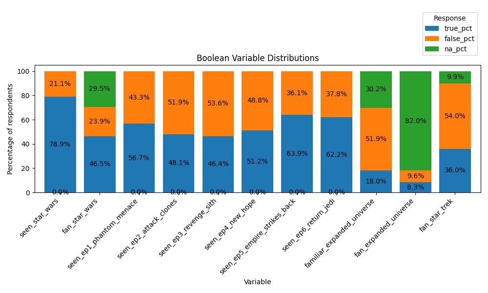
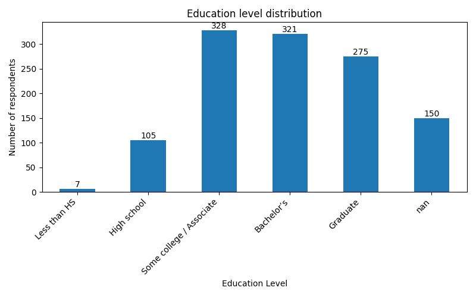
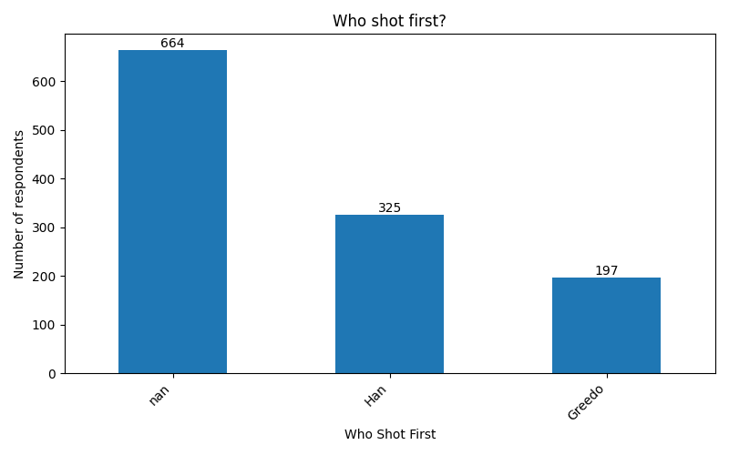

> Project: Star Wars Survey  
> Phase: 1 — Exploratory Data Analysis  
> Data version: star_wars_clean.parquet  
> Generated by: analysis scripts in /analysis  

# Phase 1 --- Exploratory Data Analysis (EDA)

## Project Overview

This report documents **Phase 1** of the Star Wars Survey analysis
project.\
The purpose of this phase is **exploratory understanding** of the
dataset: - understand variable types and structure - assess data quality
and missingness - describe distributions and basic relationships -
identify constraints for later analysis

No causal claims, hypothesis tests, or modeling are performed in this
phase.

**Data source:** `star_wars_clean.parquet`\
**Audience:** Self (learning / portfolio project)

------------------------------------------------------------------------

## Dataset Summary

The dataset contains **1,186 respondents** and **38 columns**,
covering: - viewing behavior for Star Wars episodes - fandom
indicators - character rankings and ratings - demographic attributes

All analyses in this report are based on the **cleaned dataset**,
validated via automated checks.

------------------------------------------------------------------------

## Boolean Variables Analysis

Boolean columns capture yes/no style responses related to viewing
behavior and fandom.

### Key Boolean Columns

-   `seen_star_wars`
-   `fan_star_wars`
-   `seen_ep1_phantom_menace` ... `seen_ep6_return_jedi`
-   `familiar_expanded_universe`
-   `fan_expanded_universe`
-   `fan_star_trek`

### High-Level Findings

-   **78.9%** of respondents report having seen at least one Star Wars
    film.
-   **46.5%** identify as Star Wars fans; nearly **30%** did not answer
    this question.
-   Original trilogy episodes (IV--VI) show higher viewing rates than
    prequels.
-   Familiarity with the Expanded Universe is relatively low (**\~18%
    true**).
-   Declared fans of the Expanded Universe are rare (**\~8% true**,
    **82% missing**).
-   **36%** identify as Star Trek fans, indicating overlap potential for
    later analysis.

**Figure 1** (`analysis/figures/boolean_summary.png`) visualizes the
distribution of True / False / NA across all boolean columns.

------------------------------------------------------------------------

## Episode Ranking and Scoring

Respondents ranked Star Wars episodes from best (1) to worst (6).\
For interpretability, rankings were transformed into **scores**:

    score = 7 − rank

Thus: - 6 = best - 1 = worst

### Episode Preferences

Average scores show a clear pattern:

-   **Episode III** receives the highest average score
-   **Episode V** receives the lowest average score
-   Original trilogy episodes show stronger polarization

**Figure 2** (`analysis/figures/episode_scores.png`) shows average
episode scores by episode number.

This confirms internal consistency and aligns with common fan discourse.

------------------------------------------------------------------------

## Nominal and Ordinal Demographics

### Gender

-   Female: **46.3%**
-   Male: **41.9%**
-   Missing: **11.8%**

Gender is reasonably balanced, with moderate non-response.

### Education Level (Ordinal)

-   Some college / Associate: **27.7%**
-   Bachelor's degree: **27.1%**
-   Graduate degree: **23.2%**
-   Missing: **12.7%**

Education is well-distributed across post-secondary categories.

**Figure 3** (`analysis/figures/education_level.png`) shows the ordered
education distribution.

### Household Income (Ordinal)

-   \$50--99k is the most common bracket (**25.1%**)
-   Missing income responses are high (**27.7%**)

Income non-response suggests caution in later subgroup analysis.

**Figure 4** (`analysis/figures/household_income.png`) displays income
distribution in ordinal order.

### Census Region

All major U.S. census regions are represented. - East North Central,
Pacific, and South Atlantic are most common. - Missing region data:
**12.1%**

**Figure 5** (`analysis/figures/census_region.png`) shows regional
distribution.

### "Who Shot First?"

-   Han: **27.4%**
-   Greedo: **16.6%**
-   Missing: **56.0%**

This question exhibits **structural missingness**, likely because it was
only relevant to a subset of respondents.

**Figure 6** (`analysis/figures/who_shot_first.png`) illustrates this
imbalance.

------------------------------------------------------------------------

## Data Quality Observations

-   Missingness is **non-random** for several variables (income, fandom
    depth).
-   Boolean logic is consistent (no fans without exposure anomalies).
-   Ordinal categories are properly ordered and suitable for grouped
    analysis.
-   No row loss occurred during cleaning.

Overall, the dataset is **fit for descriptive and relational analysis**.

------------------------------------------------------------------------

## Phase 1 Conclusion

Phase 1 successfully: - validated data integrity - established clear
variable taxonomy - revealed strong descriptive patterns - identified
limitations due to missingness

The project is now ready to proceed to:

> **Phase 2 --- Relationship Analysis**
>
> (cross-tabulations, subgroup comparisons, associations)
