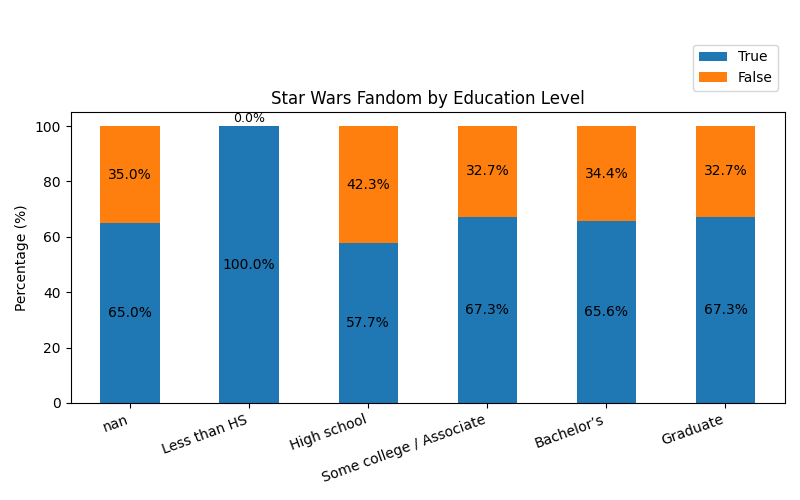
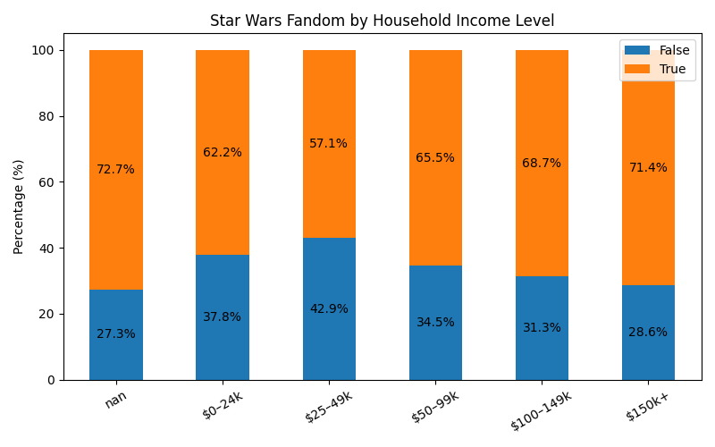
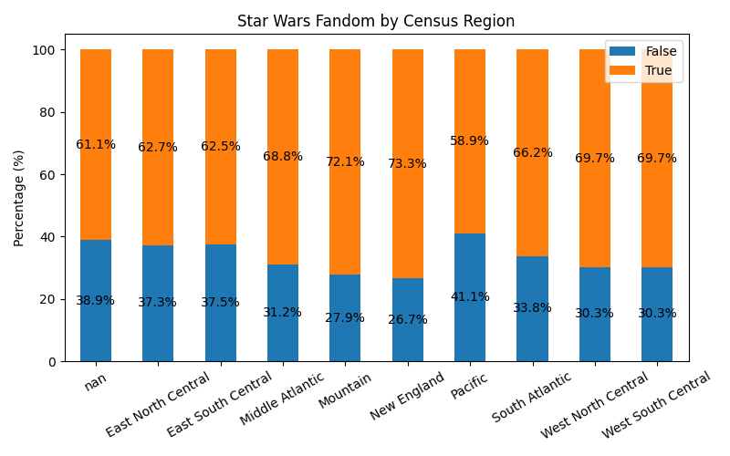
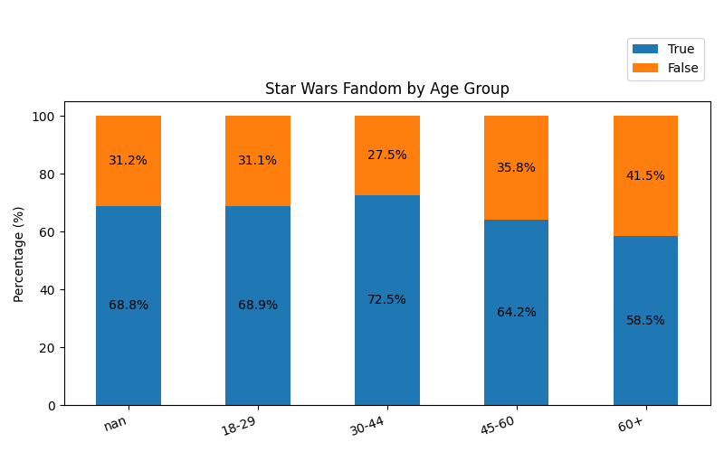

---

# Phase 2 — Bivariate Exploratory Analysis

## Phase 2.1: Binary × Binary Relationships

This phase explores relationships between pairs of binary (boolean) variables.
The goal is **descriptive understanding**, validation of survey logic, and identification of meaningful associations — **not** causal inference or hypothesis testing.

All results are presented as **contingency tables with row-wise percentages**, supported by visual heatmaps (generated but not embedded here).

---

## 2.1.1 Seen Star Wars × Star Wars Fandom

**Variables**

* `seen_star_wars`
* `fan_star_wars`

**Key observations**

* Among respondents who have **not** seen Star Wars, **100%** of responses for `fan_star_wars` are missing.
* Among respondents who **have** seen Star Wars:

  * **59%** identify as Star Wars fans
  * **30%** do not identify as fans
  * **11%** did not answer the fandom question

**Interpretation**

This pattern strongly suggests **structural missingness**: the fandom question is only meaningful for respondents who have seen Star Wars.
No logically impossible combinations (e.g. “fan without having seen”) are observed.

**Conclusion**

* Survey logic is internally consistent.
* The cleaned boolean variables behave exactly as expected.

*(See Figure 2.1: Seen Star Wars × Star Wars Fandom heatmap.)*

---

## 2.1.2 Star Wars Fandom × Star Trek Fandom

**Variables**

* `fan_star_wars`
* `fan_star_trek`

**Key observations**

* Among Star Wars fans:

  * **67%** also identify as Star Trek fans
* Among Star Wars non-fans:

  * Only **16%** identify as Star Trek fans
* Respondents with missing Star Wars fandom responses show high disengagement from fandom questions overall.

**Interpretation**

There is a **strong positive association** between Star Wars fandom and Star Trek fandom.
Rather than being mutually exclusive, the two fandoms substantially overlap.

**Conclusion**

* Sci-fi fandoms appear to cluster within the same respondents.
* This finding motivates later demographic stratification (Phase 2.2).

*(See Figure 2.2: Star Wars Fandom × Star Trek Fandom heatmap.)*

---

## 2.1.3 Seen Star Wars × Star Trek Fandom

**Variables**

* `seen_star_wars`
* `fan_star_trek`

**Key observations**

* Among respondents who have seen Star Wars:

  * Approximately **44%** identify as Star Trek fans
* Among respondents who have not seen Star Wars:

  * Only **~5%** identify as Star Trek fans

**Interpretation**

Exposure to Star Wars is strongly associated with identification as a Star Trek fan.
This may reflect broader engagement with science fiction media rather than franchise-specific preferences.

**Conclusion**

* Sci-fi exposure appears to be a shared trait among respondents.
* Further analysis by demographic groups is warranted.

*(See Figure 2.3: Seen Star Wars × Star Trek Fandom heatmap.)*

---

## Phase 2.1 Summary

Across all binary × binary analyses:

* No logical contradictions were detected
* Structural missingness behaves consistently
* Several strong descriptive associations were identified
* Results validate the earlier data cleaning decisions

This confirms that the dataset is **analysis-ready** for more granular bivariate exploration.

---

### Phase 2.2 — Nominal × Binary Analysis

This phase explores how **Star Wars fandom (`fan_star_wars`) varies across nominal demographic variables**, using row-normalized contingency tables and stacked bar charts. The goal is descriptive: identifying patterns, gradients, and potential sources of heterogeneity without making causal claims.

Each figure shows the **percentage of respondents within each category who identify as Star Wars fans**, with non-fans comprising the remainder of the bar.

---

#### Gender × Star Wars Fandom

*Figure 2.2.1 — `gender_fan_star_wars.png`*

Star Wars fandom differs by gender. Male respondents show a higher proportion of fans compared to female respondents, while respondents with missing gender data fall between these two groups. This pattern is stable and aligns with prior expectations for the franchise’s audience composition.

---

#### Education Level × Star Wars Fandom

*Figure 2.2.2 — `education_fan_star_wars.png`*

Fandom rates are broadly similar across education levels from high school through graduate education. The “Less than HS” category shows a 100% fandom rate; however, this result is driven by a very small sample size and should not be overinterpreted. Overall, education level does not appear to be a strong differentiator of fandom intensity.

---

#### Household Income × Star Wars Fandom

*Figure 2.2.3 — `household_income_fan_star_wars.png`*

A mild positive gradient is visible between household income and fandom, with higher income brackets showing slightly higher proportions of fans. A substantial fraction of respondents did not report income, and this missingness is consistent with earlier phases of the analysis.

---

#### Census Region × Star Wars Fandom

*Figure 2.2.4 — `census_region_fan_star_wars.png`*

Regional differences in fandom are present but modest. New England and Mountain regions exhibit slightly higher fandom rates, while the Pacific region shows a comparatively lower share of fans. Overall, regional variation exists but does not dominate fandom patterns.

---

#### Age Group × Star Wars Fandom

*Figure 2.2.5 — `age_group_fan_star_wars.png`*

Fandom is highest among respondents aged 30–44 and declines in older age groups. Younger respondents (18–29) also show relatively high fandom levels. This pattern suggests a cohort effect consistent with the original release periods of the Star Wars films.

---

#### Summary of Nominal × Binary Findings

Across all demographic variables examined:

* Star Wars fandom is **widespread across groups**, with no category showing uniformly low interest.
* Differences by gender and age are more pronounced than those by education or region.
* Missing data (particularly income) is non-trivial and should be considered in later analyses.
* Observed patterns motivate deeper exploration but do not imply causation.

This concludes Phase 2.2. The next phase will examine relationships between **pairs of nominal variables** to better understand the demographic structure of the respondent population.

---

