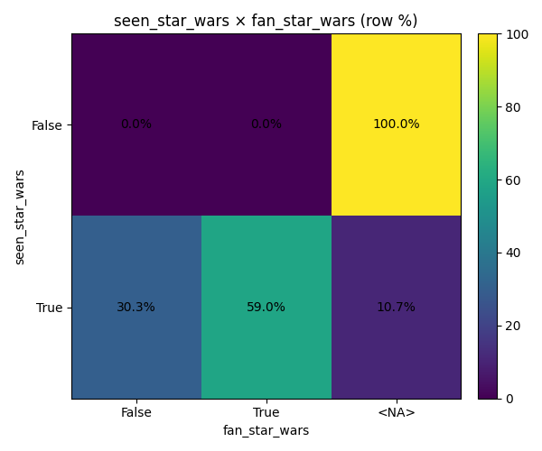
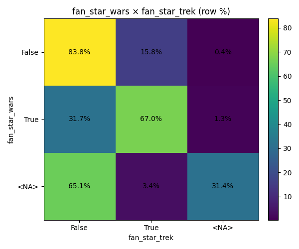
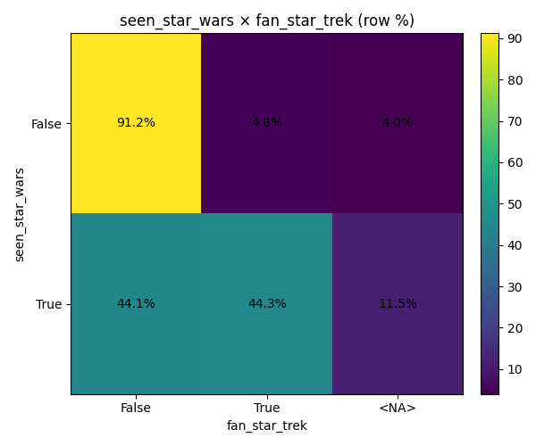
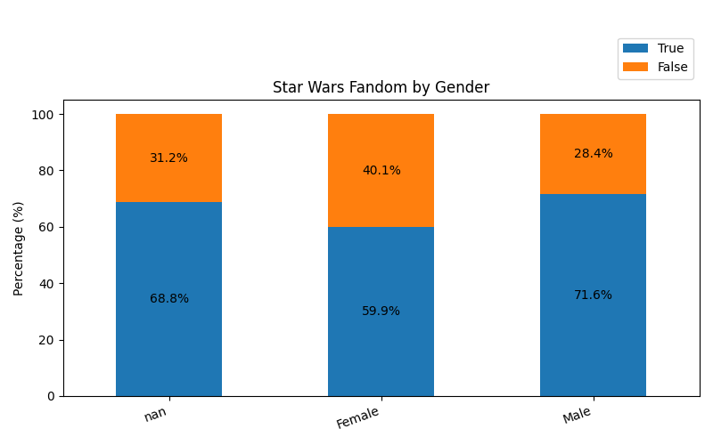
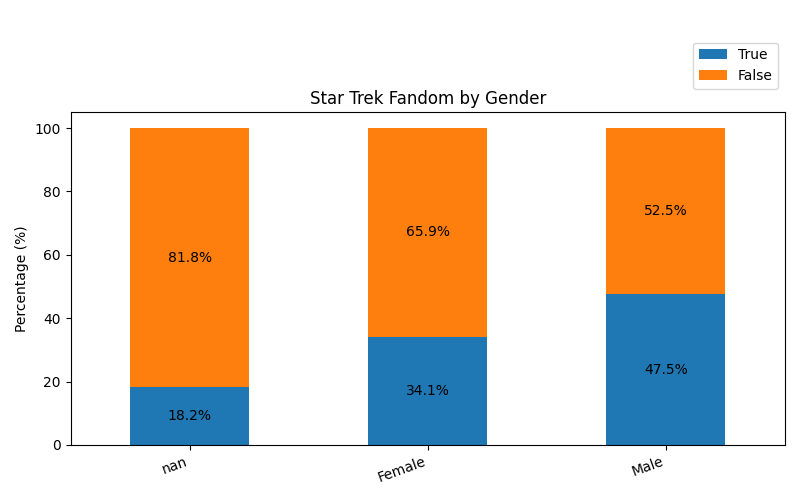

---

# Phase 2 — Bivariate Exploratory Analysis

## Phase 2.1: Binary × Binary Relationships

This phase explores relationships between pairs of binary (boolean) variables.
The goal is **descriptive understanding**, validation of survey logic, and identification of meaningful associations — **not** causal inference or hypothesis testing.

All results are presented as **contingency tables with row-wise percentages**, supported by visual heatmaps (generated but not embedded here).

---

## 2.1.1 Seen Star Wars × Star Wars Fandom

**Variables**

* `seen_star_wars`
* `fan_star_wars`

**Key observations**

* Among respondents who have **not** seen Star Wars, **100%** of responses for `fan_star_wars` are missing.
* Among respondents who **have** seen Star Wars:

  * **59%** identify as Star Wars fans
  * **30%** do not identify as fans
  * **11%** did not answer the fandom question

**Interpretation**

This pattern strongly suggests **structural missingness**: the fandom question is only meaningful for respondents who have seen Star Wars.
No logically impossible combinations (e.g. “fan without having seen”) are observed.

**Conclusion**

* Survey logic is internally consistent.
* The cleaned boolean variables behave exactly as expected.

*(See Figure 2.1: Seen Star Wars × Star Wars Fandom heatmap.)*

---

## 2.1.2 Star Wars Fandom × Star Trek Fandom

**Variables**

* `fan_star_wars`
* `fan_star_trek`

**Key observations**

* Among Star Wars fans:

  * **67%** also identify as Star Trek fans
* Among Star Wars non-fans:

  * Only **16%** identify as Star Trek fans
* Respondents with missing Star Wars fandom responses show high disengagement from fandom questions overall.

**Interpretation**

There is a **strong positive association** between Star Wars fandom and Star Trek fandom.
Rather than being mutually exclusive, the two fandoms substantially overlap.

**Conclusion**

* Sci-fi fandoms appear to cluster within the same respondents.
* This finding motivates later demographic stratification (Phase 2.2).

*(See Figure 2.2: Star Wars Fandom × Star Trek Fandom heatmap.)*

---

## 2.1.3 Seen Star Wars × Star Trek Fandom

**Variables**

* `seen_star_wars`
* `fan_star_trek`

**Key observations**

* Among respondents who have seen Star Wars:

  * Approximately **44%** identify as Star Trek fans
* Among respondents who have not seen Star Wars:

  * Only **~5%** identify as Star Trek fans

**Interpretation**

Exposure to Star Wars is strongly associated with identification as a Star Trek fan.
This may reflect broader engagement with science fiction media rather than franchise-specific preferences.

**Conclusion**

* Sci-fi exposure appears to be a shared trait among respondents.
* Further analysis by demographic groups is warranted.

*(See Figure 2.3: Seen Star Wars × Star Trek Fandom heatmap.)*

---

## Phase 2.1 Summary

Across all binary × binary analyses:

* No logical contradictions were detected
* Structural missingness behaves consistently
* Several strong descriptive associations were identified
* Results validate the earlier data cleaning decisions

This confirms that the dataset is **analysis-ready** for more granular bivariate exploration.

---

Perfect — this is **exactly** the right moment to update the Phase 2 report, and your output is *rich but still manageable*. I’ll help you turn this into **clean, analytical text**, not a data dump.

Below is a **ready-to-drop-in update** for `reports/phase_2_eda.md`.

---

# Phase 2 — Bivariate Exploratory Analysis

## 2.2 Nominal × Binary Analysis

This section explores how **demographic (nominal) variables** relate to two key binary outcomes:

* `fan_star_wars`
* `fan_star_trek`

For each pairing, row-wise percentages are reported, and stacked bar charts are referenced to visualize relative differences across categories.

---

### 2.2.1 Star Wars Fandom by Demographics (`fan_star_wars`)

**Figure 2.2.1a–e** show the proportion of respondents identifying as Star Wars fans across demographic groups.

#### Gender

Male respondents report a higher likelihood of identifying as Star Wars fans (71.6%) compared to female respondents (59.9%). Respondents with missing gender values show similar fan proportions but are few in number.

#### Education Level

Star Wars fandom is relatively consistent across education levels, ranging from approximately 58% to 67%. Respondents with “Less than High School” education show a 100% fandom rate; however, this category contains very few observations and should not be overinterpreted.

#### Household Income

Fandom rates increase modestly with income. Respondents in the highest income bracket ($150k+) show a higher fan proportion (71.4%) than those in lower income brackets, though differences across income groups are not extreme.

#### Census Region

Regional differences are relatively small. The Pacific region shows the lowest proportion of fans (58.9%), while New England and Mountain regions show higher fandom levels (above 72%). Overall, fandom appears broadly distributed across regions.

#### Age Group

Star Wars fandom peaks among respondents aged 30–44 (72.5%) and declines with age, reaching the lowest level among those aged 60+ (58.5%). This suggests a generational pattern consistent with the original release timeline of the franchise.

---

### 2.2.2 Star Trek Fandom by Demographics (`fan_star_trek`)

**Figure 2.2.2a–e** present the same demographic breakdown for Star Trek fandom, enabling direct comparison with Star Wars.

#### Gender

Male respondents are substantially more likely to identify as Star Trek fans (47.5%) than female respondents (34.1%). This gender gap is notably larger than for Star Wars fandom.

#### Education Level

Star Trek fandom increases with education level. Respondents with some college or higher education show fandom rates above 40%, compared to lower rates among those with high school education or less.

#### Household Income

Star Trek fandom shows a mild positive association with income. Respondents in higher income brackets report slightly higher fandom rates, though differences remain moderate.

#### Census Region

Regional variation is more pronounced for Star Trek than for Star Wars. The East South Central region shows the highest fandom rate (57.9%), while East North Central and Pacific regions report lower levels (around 35%).

#### Age Group

Star Trek fandom increases with age up to the 45–60 group (49.5%) and then declines slightly among respondents aged 60+. This pattern contrasts with Star Wars fandom, which peaks earlier.

---

### 2.2.3 Comparative Observations

Across all demographic dimensions:

* **Star Wars fandom is more prevalent than Star Trek fandom**
* **Star Wars appeals more strongly to younger and middle-aged respondents**
* **Star Trek fandom skews older, more male, and more educated**
* Gender differences are substantially larger for Star Trek than for Star Wars

These descriptive patterns suggest that the two franchises occupy distinct cultural and demographic niches, despite partial audience overlap.

No causal claims are made at this stage.

---
