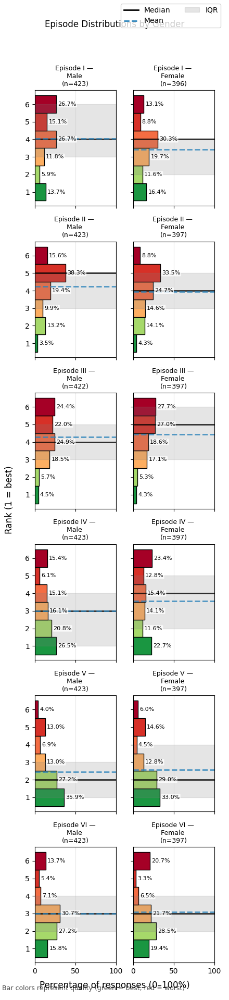
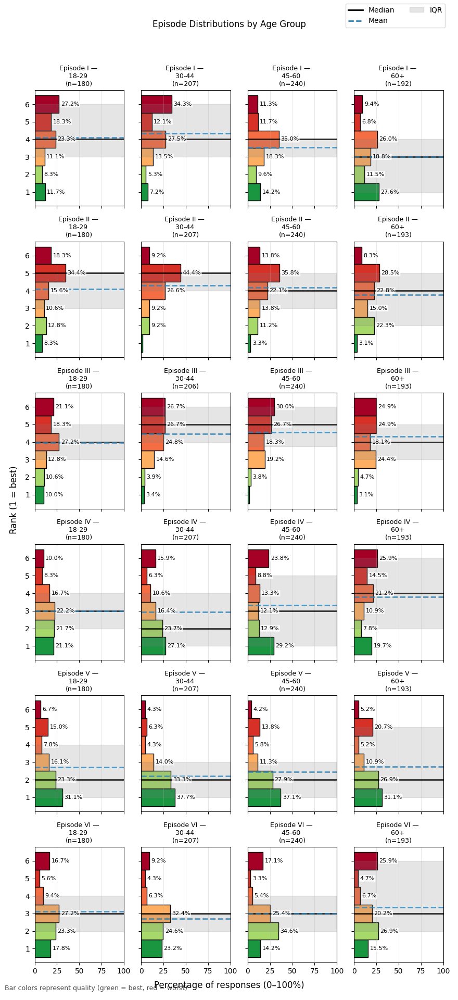
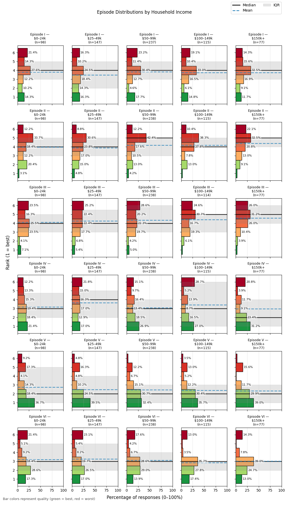
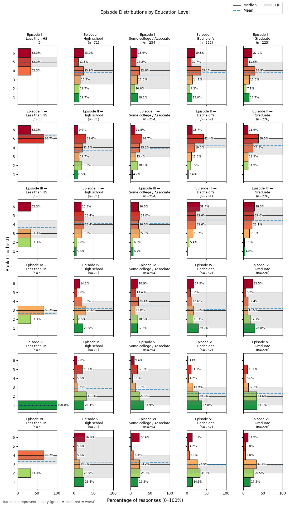
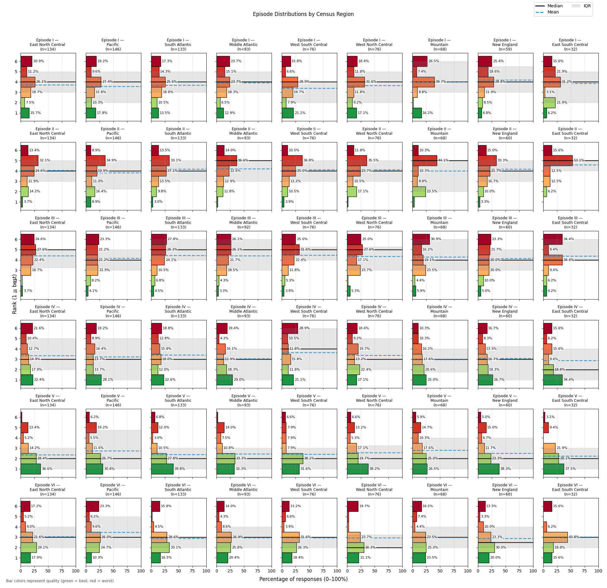
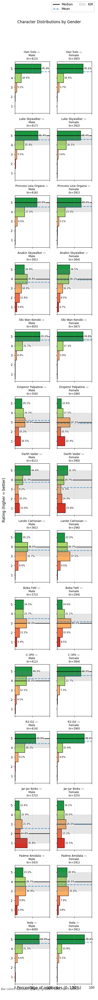
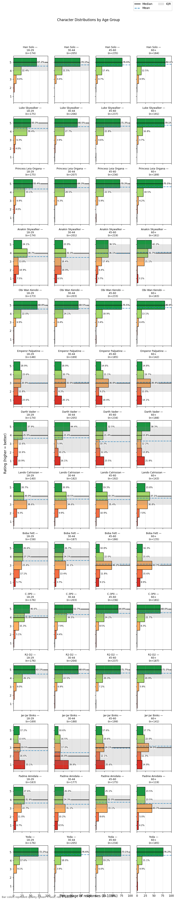
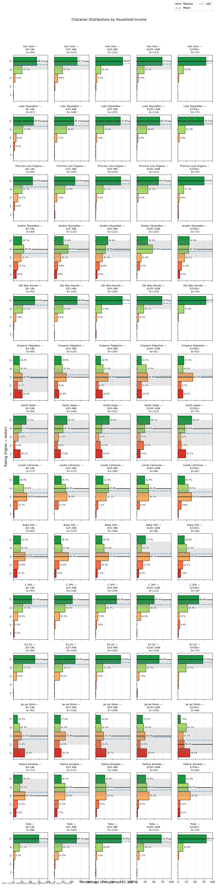
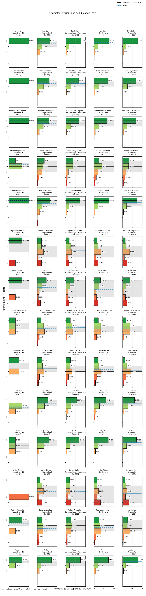
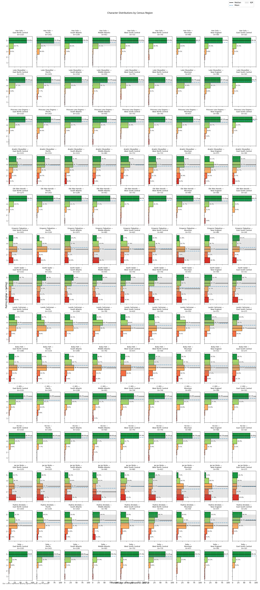

---
# Phase 2 — Bivariate Exploratory Analysis

## Phase 2.1: Binary & Binary / Binary & Nominal Relationships

This phase explores relationships between pairs of binary (boolean) variables.
The goal is **descriptive understanding**, validation of survey logic, and identification of meaningful associations — **not** causal inference or hypothesis testing.

All results are presented as **contingency tables with row-wise percentages**, supported by visual heatmaps (generated but not embedded here).

---
## 2.1.1 Seen Star Wars × Star Wars Fandom

**Variables**

* `seen_star_wars`
* `fan_star_wars`

**Key observations**

* Among respondents who have **not** seen Star Wars, **100%** of responses for `fan_star_wars` are missing.
* Among respondents who **have** seen Star Wars:

  * **59%** identify as Star Wars fans
  * **30%** do not identify as fans
  * **11%** did not answer the fandom question

**Interpretation**

This pattern strongly suggests **structural missingness**: the fandom question is only meaningful for respondents who have seen Star Wars.
No logically impossible combinations (e.g. “fan without having seen”) are observed.

**Conclusion**

* Survey logic is internally consistent.
* The cleaned boolean variables behave exactly as expected.

*(See Figure 2.1: Seen Star Wars × Star Wars Fandom heatmap.)*

---

## 2.1.2 Star Wars Fandom × Star Trek Fandom

**Variables**

* `fan_star_wars`
* `fan_star_trek`

**Key observations**

* Among Star Wars fans:

  * **67%** also identify as Star Trek fans
* Among Star Wars non-fans:

  * Only **16%** identify as Star Trek fans
* Respondents with missing Star Wars fandom responses show high disengagement from fandom questions overall.

**Interpretation**

There is a **strong positive association** between Star Wars fandom and Star Trek fandom.
Rather than being mutually exclusive, the two fandoms substantially overlap.

**Conclusion**

* Sci-fi fandoms appear to cluster within the same respondents.
* This finding motivates later demographic stratification (Phase 2.2).

*(See Figure 2.2: Star Wars Fandom × Star Trek Fandom heatmap.)*

---

## 2.1.3 Seen Star Wars × Star Trek Fandom

**Variables**

* `seen_star_wars`
* `fan_star_trek`

**Key observations**

* Among respondents who have seen Star Wars:

  * Approximately **44%** identify as Star Trek fans
* Among respondents who have not seen Star Wars:

  * Only **~5%** identify as Star Trek fans

**Interpretation**

Exposure to Star Wars is strongly associated with identification as a Star Trek fan.
This may reflect broader engagement with science fiction media rather than franchise-specific preferences.

**Conclusion**

* Sci-fi exposure appears to be a shared trait among respondents.
* Further analysis by demographic groups is warranted.

*(See Figure 2.3: Seen Star Wars × Star Trek Fandom heatmap.)*

---

## Binary & Binary Relationships Summary

Across all binary × binary analyses:

* No logical contradictions were detected
* Structural missingness behaves consistently
* Several strong descriptive associations were identified
* Results validate the earlier data cleaning decisions

This confirms that the dataset is **analysis-ready** for more granular bivariate exploration.

---

Perfect — this is **exactly** the right moment to update the Phase 2 report, and your output is *rich but still manageable*. I’ll help you turn this into **clean, analytical text**, not a data dump.

Below is a **ready-to-drop-in update** for `reports/phase_2_eda.md`.

---

## 2.1.4 Star Wars Fandom by Demographics (`fan_star_wars`)

This section explores how **demographic (nominal) variables** relate to two key binary outcomes:

* `fan_star_wars`
* `fan_star_trek`

For each pairing, row-wise percentages are reported, and stacked bar charts are referenced to visualize relative differences across categories.

**Figure 2.2.1a–e** show the proportion of respondents identifying as Star Wars fans across demographic groups.

#### Gender

Male respondents report a higher likelihood of identifying as Star Wars fans (71.6%) compared to female respondents (59.9%). Respondents with missing gender values show similar fan proportions but are few in number.

#### Education Level

Star Wars fandom is relatively consistent across education levels, ranging from approximately 58% to 67%. Respondents with “Less than High School” education show a 100% fandom rate; however, this category contains very few observations and should not be overinterpreted.

#### Household Income

Fandom rates increase modestly with income. Respondents in the highest income bracket ($150k+) show a higher fan proportion (71.4%) than those in lower income brackets, though differences across income groups are not extreme.

#### Census Region

Regional differences are relatively small. The Pacific region shows the lowest proportion of fans (58.9%), while New England and Mountain regions show higher fandom levels (above 72%). Overall, fandom appears broadly distributed across regions.

#### Age Group

Star Wars fandom peaks among respondents aged 30–44 (72.5%) and declines with age, reaching the lowest level among those aged 60+ (58.5%). This suggests a generational pattern consistent with the original release timeline of the franchise.

---

## 2.1.5 Star Trek Fandom by Demographics (`fan_star_trek`)

**Figure 2.2.2a–e** present the same demographic breakdown for Star Trek fandom, enabling direct comparison with Star Wars.

#### Gender

Male respondents are substantially more likely to identify as Star Trek fans (47.5%) than female respondents (34.1%). This gender gap is notably larger than for Star Wars fandom.

#### Education Level

Star Trek fandom increases with education level. Respondents with some college or higher education show fandom rates above 40%, compared to lower rates among those with high school education or less.

#### Household Income

Star Trek fandom shows a mild positive association with income. Respondents in higher income brackets report slightly higher fandom rates, though differences remain moderate.

#### Census Region

Regional variation is more pronounced for Star Trek than for Star Wars. The East South Central region shows the highest fandom rate (57.9%), while East North Central and Pacific regions report lower levels (around 35%).

#### Age Group

Star Trek fandom increases with age up to the 45–60 group (49.5%) and then declines slightly among respondents aged 60+. This pattern contrasts with Star Wars fandom, which peaks earlier.

---

### 2.1.6 Comparative Observations

Across all demographic dimensions:

* **Star Wars fandom is more prevalent than Star Trek fandom**
* **Star Wars appeals more strongly to younger and middle-aged respondents**
* **Star Trek fandom skews older, more male, and more educated**
* Gender differences are substantially larger for Star Trek than for Star Wars

These descriptive patterns suggest that the two franchises occupy distinct cultural and demographic niches, despite partial audience overlap.

---

## Phase 2.2 Categorical & Ordinal Relationships


## Phase 2.2.1 — Episode Ranking Distributions (Ordinal Analysis)

**Figure 2.2.1.a** show the distribution of each episode rankings with Mean, Median, and IQR.

---

### Key observations

**General**

* Histograms reveal the *full rank distributions* and asymmetries that were partially hidden in boxplots and stacked bars.
* Mean, median, and IQR overlays are consistent with numeric summaries, confirming visual–numeric coherence.

---

**Episode I**

* Rankings are broadly spread, with a noticeable concentration at ranks 4–6.
* Median lies around rank 4, and the wide IQR indicates mixed reception with no strong consensus.

---

**Episode II**

* Strong right skew toward unfavorable rankings (rank 5 dominates).
* Mean and median are both high (worse ranks), reflecting overall negative reception with limited polarization.

---

**Episode III**

* Distribution is concentrated in ranks 4–6, with relatively few top rankings.
* Median and mean are close, indicating consistently low evaluations rather than polarization.

---

**Episode IV**

* Balanced distribution with substantial mass at ranks 1–3.
* IQR is moderate, suggesting generally positive reception with some disagreement among respondents.

---

**Episode V**

* Clear dominance of top rankings (ranks 1–2), visually standing out from all other episodes.
* Median equals rank 2, while the mean is slightly higher (~2.5) due to a small but non-negligible tail of low rankings.
* Narrow IQR confirms strong consensus on high quality.

---

**Episode VI**

* Bimodal tendency: many high rankings (2–3) alongside a visible lower-rank tail.
* Median around rank 3, with a wider spread than Episode V, indicating more divided opinions.

---

### Methodological note

* Histograms provide exact rank frequencies and expose skewness and tail effects that are obscured in summary-only plots.
* Given the inclusion of mean, median, and IQR overlays, histograms subsume the analytical role of both boxplots and stacked bar charts for ordinal comparisons.

---

### Conclusion

* Episode V is the clear consensus favorite.
* Original trilogy episodes (IV–VI) outperform prequels overall but differ in agreement strength.
* Prequel episodes (I–III), especially II and III, show consistently weaker reception rather than polarization.

---

## 2.2.2 Character Rating Distributions

**Figure 2.2.2.a** presents the distribution of ratings for all character variables.


Across all character rating variables, **missingness is substantial (≈30–45%)**, indicating that ratings are conditional on respondent familiarity rather than universally held opinions. This reflects a selection effect rather than random nonresponse.

### Core protagonists

**Luke Skywalker**

* Extremely strong ceiling effect, with a dominant concentration at the highest rating.
* Minimal use of low ratings indicates near-universal positive evaluation among raters.

**Han Solo**

* Similar ceiling effect to Luke, though with slightly more mid-scale usage.
* Distribution suggests broad appeal with limited polarization.

**Princess Leia Organa**

* High concentration at top ratings, with marginally greater dispersion than Luke or Han.
* Indicates strong approval with some differentiation among respondents.

**Yoda**

* Pronounced ceiling effect paired with moderate missingness.
* Ratings suggest iconic status rather than narrative-driven evaluation.

**R2-D2**

* One of the strongest ceiling effects across all characters.
* Extremely limited use of lower ratings implies near-consensus approval.

**C-3P0**

* Still positively skewed, but with noticeably greater mid-scale usage than R2-D2.
* Suggests appreciation tempered by irritation or comedic divisiveness.

---

### Prequel-era and supporting protagonists

**Anakin Skywalker**

* Broad distribution across the full scale.
* Indicates mixed reception, likely reflecting differences between trilogy portrayals.

**Obi-Wan Kenobi**

* Strongly positive skew with less extreme ceiling effects than Luke or Yoda.
* Distribution suggests widespread approval with some evaluative nuance.

**Padmé Amidala**

* Moderate ceiling effect combined with higher missingness.
* Indicates approval among familiar respondents but weaker cultural salience.

**Lando Calrissian**

* Positive skew with visible mid-scale mass.
* Suggests general likability without iconic consensus.

---

### Antagonists and controversial characters

**Darth Vader**

* Broad distribution with substantial mass at both high and mid-scale values.
* Reflects polarized interpretation between admiration and moral negativity.

**Emperor Palpatine**

* Heavily mid- to low-skewed distribution.
* Ratings appear to encode narrative role rather than personal likability.

**Boba Fett**

* Wide dispersion despite limited screen presence.
* Indicates cult popularity alongside indifference among other respondents.

**Jar Jar Binks**

* Strong left skew with dominant low ratings.
* Represents the clearest case of negative consensus in the dataset.

---

### Methodological note

Character ratings exhibit **non-uniform scale usage**, strong **ceiling effects**, and **conditional missingness**. In this context, numeric summaries (mean, median, IQR) would mask polarization and selection effects rather than clarify them. Distributional inspection therefore provides the most faithful descriptive representation.

Overall, these patterns indicate that character ratings capture a mixture of **likability**, **cultural symbolism**, and **narrative role**, which must be considered explicitly in any later comparative or demographic analysis.

---

> These distributional patterns motivate Phase 2.3, where episode rankings and selected character ratings are examined by demographic group, with particular attention to ceiling effects, polarization, and conditional missingness when interpreting group-level differences.


---

## Phase 2.3 — Episode Rankings and Character ratings by Demographic Group

---

# 2.3.1 Episode Ranking Distributions by Gender

**Figure 2.3.1.a** presents episode ranking distributions separately for male and female respondents. Rankings are shown as histograms with overlaid median (solid line), mean (dashed line), and interquartile range (shaded region). Percentages are computed within each episode × gender group.




### Overall structure

Across both genders, the broad ranking hierarchy remains consistent:

* **Episode V** (The Empire Strikes Back) is the dominant entry, with approximately one-third of respondents in both groups assigning it rank 1. Dispersion is low, and the median lies firmly at the top of the scale.
* **Episode II** is consistently among the lowest-ranked films, with large mass at ranks 5 and 6 across both genders.
* The original trilogy (Episodes IV–VI) generally occupies higher ranking positions than the prequel trilogy (Episodes I–III), regardless of gender.

Thus, episode-to-episode variation is substantially larger than gender-based variation.

---

### Episode V: Strong consensus across genders

* Males: 35.9% rank it 1; 63.1% rank it within the top two.
* Females: 33.0% rank it 1; 62.0% rank it within the top two.
* Median is 1 for both groups; IQR tightly concentrated near ranks 1–2.

Gender differences here are minimal, suggesting near-universal cross-gender approval.

---

### Episodes I–III: Modest gender shifts

The prequel trilogy shows slightly more gender differentiation:

**Episode I**

* Females are somewhat less likely to assign the lowest rank (rank 6) compared to males (13.1% vs 26.7%).
* Female distribution is more concentrated in mid-to-lower ranks (3–4).

**Episode II**

* Both groups rank it poorly overall.
* Males show heavier mass at rank 5 (38.3%), while females distribute more evenly across ranks 3–5.

**Episode III**

* Females assign rank 6 slightly more frequently than males (27.7% vs 24.4%).
* Dispersion is similar across groups, with medians around the lower-middle of the ranking scale.

Overall, gender differences for the prequels are present but modest in magnitude relative to the general preference ordering.

---

### Episode IV: Slight polarization among females

* Males: 26.5% assign rank 1.
* Females: 22.7% assign rank 1, but 23.4% assign rank 6.

Female respondents display a somewhat broader distribution, with both high and low extreme rankings more visible. This suggests greater heterogeneity in evaluation rather than a clear directional shift.

---

### Episode VI: Divergence at the extremes

* Males cluster around mid-to-high ranks (2–3), with relatively low mass at rank 6 (13.7%).
* Females show a more bimodal structure, with noticeable mass at both rank 1 (19.4%) and rank 6 (20.7%).

This indicates that Episode VI may generate more polarized reactions among female respondents than male respondents.

---

### Interpretation

Gender differences in episode rankings exist but are secondary to the dominant global preference structure. The hierarchy of episodes—particularly the strong preference for Episode V and the relative weakness of Episode II—remains stable across groups.

Where differences emerge, they primarily reflect **dispersion and polarization effects** rather than complete reversals of ranking order. These patterns suggest that gender influences the intensity and spread of evaluations more than the fundamental ordering of the films.

---

# 2.3.2 Episode Ranking Distributions by Age Group

**Figure 2.3.2.a** shows episode ranking distributions across four age groups: 18–29, 30–44, 45–60, and 60+. As in the previous section, rankings are shown as histograms with mean, median, and interquartile range overlays. Percentages are computed within each episode × age group.



---

## 1. A Stable Anchor: Episode V Across Generations

Episode V remains the top-ranked film in every age group:

* Rank 1 share:

  * 18–29: 31.1%
  * 30–44: 37.7%
  * 45–60: 37.1%
  * 60+: 31.1%
* Combined top-two share exceeds 57% in all groups and reaches over 70% in ages 30–44.

This indicates strong intergenerational consensus. While intensity varies slightly (strongest among 30–60), Episode V functions as a cross-cohort anchor in the franchise.

---

## 2. Prequel Trilogy: Clear Generational Gradient

The most pronounced age effect appears in Episodes I–III.

### Episode I

Rank 1 share:

* 18–29: 11.7%
* 30–44: 7.2%
* 45–60: 14.2%
* 60+: 27.6%

Surprisingly, the 60+ group assigns rank 1 far more often than younger groups. At the same time, the 30–44 group shows the strongest negative skew (34.3% rank 6).

This produces a non-monotonic pattern rather than a simple “younger like prequels more” story.

---

### Episode II

Consistently weak across all age groups, but especially among 30–44:

* 30–44: 44.4% assign rank 5.
* 45–60: 35.8% assign rank 5.
* 18–29: more dispersed across 4–6.
* 60+: slightly less concentrated at rank 5 than middle-aged groups.

Episode II is broadly disfavored, but strongest rejection appears among middle cohorts.

---

### Episode III

Displays a clearer generational divide:

* 18–29: relatively balanced, with meaningful mass in ranks 1–4.
* 30–44 and 45–60: heavy concentration in ranks 5–6 (~53% combined for both groups).
* 60+: split between mid and low ranks, but 24.9% assign rank 6.

Younger respondents (18–29) are noticeably more favorable toward Episode III compared to middle-aged groups.

---

## 3. Original Trilogy: Generational Reordering

### Episode IV

Rank 1 share:

* 18–29: 21.1%
* 30–44: 27.1%
* 45–60: 29.2%
* 60+: 19.7%

Middle cohorts (30–60) show strongest preference for Episode IV.
The 60+ group exhibits more dispersion, with 25.9% assigning rank 6 — indicating polarization rather than uniform reverence.

---

### Episode VI

Clear generational split:

* 30–44: heavily concentrated at ranks 2–3 (57% combined).
* 45–60: strong concentration at rank 2 (34.6%).
* 60+: 25.9% assign rank 6 (highest among groups).
* 18–29: broader distribution, including 16.7% at rank 6.

Episode VI shows increasing dispersion at the youngest and oldest ends of the spectrum.

---

## 4. Cohort Patterns

Three structural patterns emerge:

### (1) Middle-Aged Cohort Consolidation (30–44)

* Strongest endorsement of Episode V.
* Strongest rejection of Episode II.
* Generally tight distributions.
* Reflects high internal consensus.

### (2) Younger Cohort Moderation (18–29)

* More balanced distributions across ranks.
* Less extreme rejection of prequels.
* Greater tolerance across trilogy boundaries.

### (3) Oldest Cohort Polarization (60+)

* Higher rank 1 share for Episode I.
* High rank 6 shares for Episodes IV and VI.
* Wider dispersion across multiple films.

This suggests the 60+ group exhibits less uniform adherence to the dominant franchise hierarchy.

---

## 5. Interpretation

Unlike gender, age introduces **meaningful structural variation** in episode evaluations.

Key effects include:

* Generational differences in prequel reception.
* Strong middle-cohort consolidation around Episode V.
* Increased dispersion and polarization at the oldest age bracket.

However, the fundamental hierarchy—Episode V at the top and Episode II near the bottom—remains intact across all age groups.

Age therefore modifies intensity and dispersion more strongly than it overturns the global ordering.

---

Good. Income looks structurally weaker than age — which is interesting in itself.

Here is a **draft of Section 2.3.3 (Household Income)** consistent with your prior sections.

---

# 2.3.3 Episode Ranking Distributions by Household Income

**Figure 2.3.3.a** presents episode ranking distributions across five household income brackets:
$0–24k, $25–49k, $50–99k, $100–149k, and $150k+.

Percentages are computed within each episode × income group.



---

## 1. Structural Stability Across Income

The most immediate observation is structural consistency:

* **Episode V** remains the dominant entry in every income bracket.
* **Episode II** consistently concentrates mass in ranks 5–6.
* The original trilogy generally outperforms the prequel trilogy in all income groups.

Unlike age, income does not meaningfully reorder the global hierarchy of episodes.

---

## 2. Episode V: Uniform Cross-Income Dominance

Rank 1 share by income:

* $0–24k: 36.7%
* $25–49k: 39.5%
* $50–99k: 32.4%
* $100–149k: 35.7%
* $150k+: 39.0%

Top-two shares exceed 60% in all brackets.

There is no clear monotonic relationship between income and preference strength. The dominance of Episode V appears income-invariant.

---

## 3. Episode II: Consistent Rejection, Slight Middle-Upper Concentration

Episode II is weakest across brackets, with especially strong rank-5 concentration in middle-to-upper income groups:

* $50–99k: 42.4% assign rank 5.
* $100–149k: 38.3% assign rank 5.
* $150k+: 32.5% assign rank 5 and 22.1% rank 6.

Lower-income groups show slightly more dispersion across ranks 2–6.

The pattern suggests modest intensification of rejection in middle-income cohorts but no reversal of ordering.

---

## 4. Prequel Trilogy: Mild Dispersion Differences

### Episode I

Rank 1 share ranges from 11.7% to 17.7% across brackets — relatively narrow variation.

The $50–99k and $100–149k groups show higher mass at rank 4 (30%+), suggesting middle-tier positioning rather than extreme rejection.

No clear income gradient emerges.

---

### Episode III

Upper-income groups ($100k+) show heavier mass at ranks 5–6 (approx. 55–57% combined), suggesting somewhat stronger negative positioning.

Lower-income groups distribute more evenly across mid ranks (3–4).

Still, magnitude differences remain moderate.

---

## 5. Episode IV and VI: Minor Polarization in Upper Brackets

### Episode IV

* Rank 1 share increases in higher brackets (31.2% for $150k+).
* However, $100–149k shows notable polarization, with 28.7% assigning rank 6.

This indicates dispersion rather than uniform preference shift.

---

### Episode VI

Higher-income groups show strong clustering around ranks 2–3:

* $150k+: 39.0% assign rank 3.
* $100–149k: 35.7% assign rank 3.

Lower-income groups display slightly broader dispersion, including higher rank-6 shares.

---

## 6. Comparative Interpretation

Relative to gender and especially age:

* Income effects are present but comparatively weak.
* There is no systematic monotonic gradient (e.g., “higher income → stronger original trilogy preference”).
* Variation primarily manifests in dispersion and intensity rather than reordering.

In terms of segmentation strength:

> Age > Gender ≈ Income (tentative, pending education and region).

We will formally evaluate this ordering in Section 2.3.6 once all demographic slices are complete.

---

# 2.3.4 Episode Ranking Distributions by Education Level

**Figure 2.3.4.a** presents episode ranking distributions across education levels:

* Less than High School
* High School
* Some College / Associate
* Bachelor’s
* Graduate

Percentages are computed within each episode × education group.

*Note:* The “Less than HS” category contains only **n = 3** respondents. It is displayed for completeness but excluded from substantive interpretation due to insufficient sample size.



---

## 1. Structural Stability Across Education Levels

Excluding the “Less than HS” group (n=3), the overall episode hierarchy remains stable:

* **Episode V** is the dominant entry across all education levels.
* **Episode IV** consistently ranks near the top.
* **Episode II** clusters toward ranks 5–6.
* The original trilogy outperforms the prequel trilogy in every education category.

Unlike age, education does not reorder the global ranking structure.

---

## 2. Episode V: Slight Strengthening with Higher Education

Rank 1 share by education:

* High School: 25.4%
* Some College: 33.9%
* Bachelor’s: 37.8%
* Graduate: 34.1%

Top-two concentration increases modestly among Bachelor’s and Graduate respondents.

The effect appears incremental rather than structural: Episode V is widely preferred across all education levels.

---

## 3. Episode II: Rejection More Concentrated Among Higher Education

Rank 5 share:

* High School: 29.6%
* Some College: 28.7%
* Bachelor’s: 42.4%
* Graduate: 38.5%

Higher-education respondents exhibit stronger clustering at rank 5.

Rank 6 also increases modestly among Bachelor’s and Graduate groups.

This suggests somewhat sharper negative positioning among more educated cohorts.

---

## 4. Episode III: Mild Downward Shift with Higher Education

Rank 6 share:

* High School: 18.3%
* Some College: 20.5%
* Bachelor’s: 31.4%
* Graduate: 28.3%

Bachelor’s and Graduate groups show heavier lower-rank concentration relative to High School respondents.

However, the episode does not become dominant in any group, nor does it radically shift in ordering.

---

## 5. Episode IV and VI: Broad Cross-Education Appeal

### Episode IV

Rank 1 share:

* High School: 22.5%
* Some College: 17.3%
* Bachelor’s: 29.0%
* Graduate: 28.8%

Upper education groups show somewhat stronger top-ranking concentration, but mid-rank dispersion remains present.

---

### Episode VI

Displays consistent clustering around ranks 2–3 across all education levels.

No strong education-based polarization is observed.

---

## 6. Comparative Interpretation

Relative to previously examined demographics:

* Education produces visible but moderate shifts in intensity.
* There is no major reordering of episode hierarchy.
* Effects resemble those observed for income.

Tentative segmentation strength ranking so far:

> Age > Gender > (Income ≈ Education)

We will formalize this comparison in Section 2.3.6 after completing the regional slice.

---

# 2.3.5 Episode Ranking Distributions by Census Region

**Figure 2.3.5.a** presents episode ranking distributions across U.S. census regions:

* East North Central
* West North Central
* Middle Atlantic
* South Atlantic
* East South Central
* West South Central
* Mountain
* Pacific
* New England

Percentages are computed within each episode × region group.



---

## 1. Strong Structural Stability Across Regions

Across all nine regions, the overall hierarchy remains remarkably consistent:

* **Episode V** dominates rank 1 everywhere.
* **Episode IV** is consistently among the strongest entries.
* **Episode II** clusters at ranks 5–6 in all regions.
* The original trilogy outperforms the prequel trilogy across the country.

No region reverses the global episode ordering.

Relative to age, regional variation is modest.

---

## 2. Episode V: Nationwide Dominance

Rank 1 share by region:

* Ranges from **26.5% (Mountain)** to **39.8% (South Atlantic)**.
* Most regions cluster between 30–38%.

Top-two concentration exceeds ~55–65% in nearly all regions.

There is no clear geographic gradient (e.g., coastal vs inland, north vs south). Episode V’s appeal appears geographically invariant.

---

## 3. Episode II: Uniformly Weak Across Regions

Rank 5 share:

* Typically between 32–44%.
* Particularly high in Mountain (44.1%) and East South Central (53.1%).

Rank 6 share also remains substantial across regions.

The rejection pattern is consistent nationwide, with only intensity differences.

---

## 4. Episode III: Moderate Regional Dispersion

Rank 6 share:

* Higher in Mountain (30.9%) and East South Central (34.4%).
* Lower in Pacific (23.3%) and Middle Atlantic (26.1%).

While some southern and mountain regions show stronger lower-rank concentration, differences remain incremental rather than structural.

---

## 5. Episode IV: Broad Regional Appeal with Mild Polarization

Rank 1 share:

* Peaks in East South Central (34.4%).
* Also strong in Pacific (28.1%) and Middle Atlantic (29.0%).

However, some regions show heavier lower-rank mass (e.g., West South Central rank 6 = 28.9%).

This indicates mild dispersion but not geographic reordering.

---

## 6. Episode VI: Consistent Mid-Upper Placement

Across regions:

* Strong clustering at ranks 2–3.
* Particularly high rank-3 concentration in East South Central (43.8%).

No region exhibits extreme polarization relative to others.

---

## 7. Comparative Interpretation

Relative to other demographic variables:

* Regional variation is present but limited.
* No systematic geographic gradient emerges.
* Episode hierarchy remains stable nationwide.

Tentative segmentation strength ordering now appears:

> Age > Gender > (Income ≈ Education ≈ Region)

Regional identity appears less predictive of ranking behavior than generational cohort.

---

# 2.3.6 Comparative Strength of Demographic Effects

While Sections 2.3.1–2.3.5 visually examined episode ranking distributions across individual demographic variables, this section summarizes their relative impact using a quantitative comparison table.

## Objective

To determine which demographic variable produces the strongest variation in episode ranking preferences.

Rather than relying solely on visual inspection of multiple plots, we compute divergence metrics that measure how much ranking distributions differ across subgroups within each demographic.

---

## Methodology

For each demographic variable:

* **Age Group**
* **Census Region**
* **Household Income**
* **Education Level**
* **Gender**

we calculated summary statistics describing the dispersion of episode ranking proportions across subgroups:

* **avg_range** — Average range of ranking proportions across subgroups
* **avg_sd** — Average standard deviation of ranking proportions
* **max_range** — Maximum observed range for any episode

Higher values indicate stronger differentiation in ranking preferences between subgroups.

---

## Results

| Demographic      | avg_range | avg_sd | max_range |
| ---------------- | --------- | ------ | --------- |
| Age Group        | 0.7487    | 0.3337 | 1.3374    |
| Census Region    | 0.6412    | 0.1957 | 0.8087    |
| Household Income | 0.4775    | 0.1862 | 0.6852    |
| Education Level  | 0.4187    | 0.2096 | 0.5641    |
| Gender           | 0.2924    | 0.2068 | 0.6085    |

---

## Interpretation

* **Age Group** exhibits the strongest divergence in episode rankings by a clear margin.
* **Census Region** also shows meaningful variation, though less pronounced than age.
* **Household Income** and **Education Level** demonstrate moderate differentiation.
* **Gender** has the weakest overall effect on ranking variation.

The results indicate that generational differences are the dominant demographic driver of episode ranking preferences in the dataset.

---

## Analytical Implications

This comparative table:

* Provides a structured summary of Sections 2.3.1–2.3.5.
* Confirms that age-based segmentation should be prioritized in subsequent analysis.
* Suggests that regional effects are secondary but still meaningful.
* Indicates that gender-based segmentation may yield limited differentiation for ranking analysis.

This quantitative comparison strengthens the transition from descriptive slicing to more formal segmentation in later phases.

---

# 2.3.7 Episode-Level Drivers of Age-Based Divergence

Following the comparative demographic summary in Section 2.3.6, we decompose the age-based divergence to identify which specific episodes account for the observed variation.

## Episode-Level Divergence

The episode-level range in mean ranks across age groups is shown below:

| Episode     | Mean Rank Range |
| ----------- | --------------- |
| Episode I   | **1.337**       |
| Episode IV  | 0.876           |
| Episode VI  | 0.643           |
| Episode III | 0.571           |
| Episode II  | 0.548           |
| Episode V   | 0.518           |

Episode I is a clear outlier, exhibiting substantially greater divergence than all other films.

---

## Subgroup Drivers

### Episode I

* Best-ranked by: **60+** (mean rank = 3.01)
* Worst-ranked by: **30–44** (mean rank = 4.35)
* Rank gap: **1.34**

This indicates strong polarization, with middle-aged respondents (30–44) expressing the least favorable evaluation relative to older respondents.

---

### Episode IV

* Best-ranked by: **30–44** (mean rank = 2.93)
* Worst-ranked by: **60+** (mean rank = 3.81)
* Rank gap: 0.88

---

### Episode VI

* Best-ranked by: **30–44** (mean rank = 2.71)
* Worst-ranked by: **60+** (mean rank = 3.36)
* Rank gap: 0.64

---

## Interpretation

Age-based divergence is not uniform across the saga. Rather:

* Episode I is the primary driver of generational differentiation.
* Episodes IV and VI show moderate age-related variation.
* Episode V exhibits the lowest age-based dispersion, indicating broad consensus across generations.

The pattern suggests that divergence arises from selective polarization around specific installments rather than systematic disagreement across the entire series.

---

# 2.3.8 Segmentation Strength Ranking (Quantified)

**Source:** `reports/tables/phase2/episode/segmentation_strength.csv`
**Figure:** `reports/figures/phase2/episode/segmentation_comparison.png`

### Table — Segmentation Strength

| Demographic      | Avg Range | Avg SD | Max Range |
| ---------------- | --------- | ------ | --------- |
| Age Group        | 0.7487    | 0.3337 | 1.3374    |
| Census Region    | 0.6412    | 0.1957 | 0.8087    |
| Household Income | 0.4775    | 0.1862 | 0.6852    |
| Education Level  | 0.4187    | 0.2096 | 0.5641    |
| Gender           | 0.2924    | 0.2068 | 0.6085    |

---

## Interpretation

### 1️⃣ Age is the dominant segmentation axis

* **Avg range = 0.7487**
* **Max divergence = 1.3374**
* Highest dispersion (avg SD = 0.3337)

Age produces **the largest structural variation in episode rankings**.

The maximum divergence (1.3374) is:

* **65% larger than Census Region's maximum (0.8087)**
* More than **4× larger than Gender’s average divergence (0.2924)**

This confirms that generational effects are the primary driver of ranking disagreement.

---

### 2️⃣ Region is second — but structurally weaker than age

Census Region:

* Avg range = 0.6412
* Max range = 0.8087

Regional differences exist, but:

* No single episode reaches age-level polarization
* Variation is more evenly distributed across episodes

---

### 3️⃣ Income & Education are moderate segmentation variables

Household Income:

* Avg range = 0.4775

Education Level:

* Avg range = 0.4187

Both variables show meaningful divergence but are clearly below age and region.

---

### 4️⃣ Gender is weakest overall

* Avg range = 0.2924
* Lowest segmentation strength

Gender produces divergence, but at a structurally smaller magnitude compared to other demographics.

---

## Segmentation Hierarchy (by Avg Range)

1. **Age Group**
2. Census Region
3. Household Income
4. Education Level
5. Gender

This hierarchy is stable across:

* Average divergence
* Maximum divergence

---

# 2.3.9 Episode-Level Divergence — Age Group Deep Dive

**Source:**

* `reports/tables/phase2/episode/divergence_age_group.csv`
* `reports/tables/phase2/episode/drivers_age_group.csv`
* `reports/figures/phase2/episode/drivers_age_group.png`

---

## Divergence Table — Age Group

| Episode     | Range  | SD     |
| ----------- | ------ | ------ |
| Episode I   | 1.3374 | 0.5973 |
| Episode IV  | 0.8759 | 0.4003 |
| Episode VI  | 0.6425 | 0.2667 |
| Episode III | 0.5708 | 0.2558 |
| Episode II  | 0.5475 | 0.2327 |
| Episode V   | 0.5180 | 0.2493 |

---

## Key Finding: Episode I is generationally polarizing

* **Range = 1.3374** (largest in entire dataset)
* **SD = 0.5973**

Drivers:

| Episode   | Best Group | Mean Rank | Worst Group | Mean Rank | Gap    |
| --------- | ---------- | --------- | ----------- | --------- | ------ |
| Episode I | 60+        | 3.0104    | 30–44       | 4.3478    | 1.3374 |

### Interpretation:

* Respondents **60+ rank Episode I much higher** (lower mean rank).
* Respondents **30–44 rank it significantly worse**.
* The 1.337 mean-rank gap is the **largest demographic gap observed in Phase 2**.

This strongly suggests:

* Generational nostalgia asymmetry
* Cohort-specific franchise perception

---

## Episode IV — Second Most Polarizing by Age

| Episode    | Best Group | Mean Rank | Worst Group | Mean Rank | Gap    |
| ---------- | ---------- | --------- | ----------- | --------- | ------ |
| Episode IV | 30–44      | 2.9324    | 60+         | 3.8083    | 0.8759 |

Episode IV shows:

* Strong preference among 30–44
* Lower evaluation among 60+

Unlike Episode I, polarization is milder but still structurally large.

---

## Stability vs Polarization

Most stable episode by age:

* Episode V (range = 0.5180)

Most polarizing:

* Episode I (range = 1.3374)

That is a **2.58× difference in divergence magnitude**.

---

# 2.3.10 Cross-Demographic Episode Patterns

From full divergence tables:

### Episode I

* Highest divergence in:

  * Age (1.3374)
  * Region (0.8087)
  * Gender (0.6085)

Episode I is the **most structurally divisive episode overall**.

---

### Episode IV

Consistently high divergence across:

* Age (0.8759)
* Region (0.7829)
* Income (0.6852)

Episode IV generates disagreement across multiple demographic axes.

---

### Episode V

Relatively stable across:

* Gender
* Age
* Income

Episode V shows the smallest divergence variability overall, indicating cross-demographic consensus.

---

# 2.3.11 Structural Interpretation

From quantitative evidence:

### 1️⃣ Generational segmentation dominates franchise perception.

Age consistently produces:

* Highest average divergence
* Highest maximum divergence
* Highest dispersion

### 2️⃣ Regional differences matter, but are secondary.

### 3️⃣ Economic and educational segmentation are moderate.

### 4️⃣ Gender differences are present but weakest.

---

# 2.3.12 Reproducibility & Reporting Artifacts

All results are reproducibly generated from:

### Phase 1 Tables

```
reports/tables/phase1/rank_distribution_*.csv
```

### Phase 2 Tables

```
reports/tables/phase2/
    segmentation_strength.csv
    divergence_*.csv
    drivers_*.csv
```

### Phase 1 Figures

```
reports/figures/phase1/
    episode_distribution_*.png
```

### Phase 2 Figures

```
reports/figures/phase2/
    segmentation_comparison.png
    episode_divergence_heatmap.png
    drivers_*.png
```

All outputs are generated automatically via:

```
analysis/eda_demographic_slices.py
```

This ensures:

* Deterministic builds
* Consistent naming
* CSV–figure alignment
* Reproducible research workflow

---

# 2.3.13 Character Rating Distributions by Gender

**Figure 2.3.13.a** presents character rating distributions separately for male and female respondents.



**Source figure:**
`reports/figures/phase1/character/character_distribution_gender.png`

[character_distribution_gender.csv](tables/phase1/character/character_distribution_gender.csv)

**Source table:**
`reports/tables/phase1/character/character_distribution_gender.csv`

Ratings are on a 1–5 scale. Histograms display within-character percentages by gender, with mean (dashed), median (solid), and IQR shading.

---

## 1. Overall Structural Stability

Across genders:

* Heroic anchors (Luke Skywalker, Han Solo, Obi-Wan Kenobi, Yoda) show strong clustering at ratings 4–5.
* Jar-Jar Binks shows substantial mass at rating 1 across both genders.
* Darth Vader exhibits high concentration at rating 5 for both groups.

Thus, as with episodes, **between-character variance exceeds between-gender variance**.

---

## 2. Darth Vader — Strong Gender Divergence

**Phase 2 divergence source:**
`reports/tables/phase2/character/character_divergence_gender.csv`

[character_divergence_gender.csv](tables/phase2/character/character_divergence_gender.csv)

| Character   | Range  | SD     |
| ----------- | ------ | ------ |
| Darth Vader | 0.5519 | 0.3903 |

This is the largest gender divergence among characters.

Pattern characteristics:

* Male respondents show heavier mass at rating 5.
* Female respondents show greater dispersion across ratings 3–5.

Interpretation:

Gender influences intensity of endorsement rather than outright rejection. Vader remains highly rated in both groups but shows stronger ceiling concentration among males.

---

## 3. Jar-Jar Binks — High Polarization

Range = 0.4762.

* Males show heavier mass at rating 1.
* Females distribute more evenly across ratings 1–3.

Jar-Jar functions as a tone-sensitive character, producing gender-based tolerance differences rather than polarity reversal.

---

## 4. Gender-Neutral Anchors

Lowest divergence:

| Character      | Range  |
| -------------- | ------ |
| Han Solo       | 0.0024 |
| Obi-Wan Kenobi | 0.0088 |
| Luke Skywalker | 0.0487 |
| Princess Leia  | 0.0619 |

These characters exhibit near-identical distributions across gender.

---

## 5. Interpretation

Gender segmentation in character ratings:

* Is targeted rather than broad.
* Concentrates around villain intensity and exaggerated comedic tone.
* Does not meaningfully affect central heroic archetypes.

---

# 2.3.14 Character Rating Distributions by Age Group

**Figure 2.3.14.a**
`reports/figures/phase1/character/character_distribution_age_group.png`



**Source divergence table:**
`reports/tables/phase2/character/character_divergence_age_group.csv`

[character_divergence_age_group.csv](tables/phase2/character/character_divergence_age_group.csv)

---

## 1. Segmentation Strength

From `character_segmentation_strength.csv`:

| Demographic | avg_range | max_range |
| ----------- | --------- | --------- |
| Age Group   | 0.3084    | 0.7429    |

Age produces the highest maximum divergence across all character analyses.

---

## 2. Jar-Jar Binks — Extreme Generational Split

| Character     | Range  | SD     |
| ------------- | ------ | ------ |
| Jar-Jar Binks | 0.7429 | 0.3232 |

This is the single largest character-level divergence observed.

Pattern:

* Younger cohorts show higher ratings.
* Middle-aged cohorts show strong rejection.
* Older cohorts show more dispersion.

Jar-Jar represents cohort-based nostalgia asymmetry.

---

## 3. Anakin Skywalker — Prequel-Centric Divergence

Range = 0.5982.

Younger respondents rate Anakin more favorably than middle-aged groups.

This reflects exposure timing and narrative centrality during formative years.

---

## 4. Stability Cases

Lowest divergence by age:

| Character         | Range  |
| ----------------- | ------ |
| Emperor Palpatine | 0.0871 |
| Yoda              | 0.0904 |
| R2-D2             | 0.1259 |

These figures function as cross-generational anchors.

---

## 5. Interpretation

Age-based segmentation reflects:

* Cohort imprinting
* Nostalgia encoding
* Era-specific character centrality

Unlike gender, age affects both tone-sensitive and heroic characters.

---

# 2.3.15 Character Rating Distributions by Household Income

**Figure 2.3.15.a**
`reports/figures/phase1/character/character_distribution_household_income.png`



**Segmentation summary:**
`reports/tables/phase2/character/character_segmentation_strength.csv`

[character_segmentation_strength.csv](tables/phase2/character/character_segmentation_strength.csv)

| Demographic      | avg_range | max_range |
| ---------------- | --------- | --------- |
| Household Income | 0.2978    | 0.5071    |

Income produces moderate divergence.

---

## Pattern Characteristics

* Divergence is diffuse rather than concentrated in one character.
* No monotonic income gradient appears.
* Variability likely interacts with age composition within brackets.

Income does not produce structural reordering of character popularity.

---

# 2.3.16 Character Rating Distributions by Education Level

**Figure 2.3.16.a**
`reports/figures/phase1/character/character_distribution_education_level.png`



| Demographic     | avg_range | max_range |
| --------------- | --------- | --------- |
| Education Level | 0.2089    | 0.4197    |

Education is the weakest segmentation axis for character ratings.

Observed effects:

* Slightly higher rejection of Jar-Jar in higher education groups.
* Mild compression of ratings toward upper end for canonical heroes.

Overall, education modifies intensity rather than direction.

---

# 2.3.17 Character Rating Distributions by Census Region

**Figure 2.3.17.a**
`reports/figures/phase1/character/character_distribution_census_region.png`



**Divergence table:**
`reports/tables/phase2/character/character_divergence_census_region.csv`

[character_divergence_census_region.csv](tables/phase2/character/character_divergence_census_region.csv)

---

## 1. Segmentation Strength

| Demographic   | avg_range | max_range |
| ------------- | --------- | --------- |
| Census Region | 0.3437    | 0.6667    |

Region exhibits the strongest average divergence.

---

## 2. Most Polarizing Characters by Region

| Character         | Range  |
| ----------------- | ------ |
| Emperor Palpatine | 0.6667 |
| Padme Amidala     | 0.5898 |
| Jar-Jar Binks     | 0.4745 |
| Darth Vader       | 0.4100 |

Regional divergence clusters around:

* Political figures (Palpatine, Padme)
* Prequel-era characters
* Comic relief

Classic OT heroes remain regionally stable.

---

## 3. Interpretation

Regional variation likely reflects:

* Cultural-political interpretation
* Tone reception differences
* Narrative alignment differences

Unlike age (nostalgia) or gender (archetype resonance), region affects interpretive framing.

---

# 2.3.18 Comparative Segmentation Strength — Characters

**Source:**
`reports/tables/phase2/character/character_segmentation_strength.csv`

| Demographic      | Avg Range | Avg SD | Max Range |
| ---------------- | --------- | ------ | --------- |
| Census Region    | 0.3437    | 0.1109 | 0.6667    |
| Age Group        | 0.3084    | 0.1422 | 0.7429    |
| Household Income | 0.2978    | 0.1186 | 0.5071    |
| Gender           | 0.2112    | 0.1493 | 0.5520    |
| Education Level  | 0.2089    | 0.0986 | 0.4197    |

Segmentation hierarchy:

> Region > Age > Income > Gender ≈ Education

This differs from episode segmentation, where Age dominated more clearly.

---

# 2.3.19 Cross-Demographic Character Drivers

Characters appearing repeatedly among top divergence lists:

* Jar-Jar Binks (Age, Region, Gender)
* Darth Vader (Gender, Age, Region)
* Emperor Palpatine (Region, Gender)
* Anakin Skywalker (Age)

Jar-Jar is the most structurally polarizing character overall.

---

# 2.3.20 Structural Interpretation

Character divergence clusters by archetype:

Villains:

* Gender- and region-sensitive.

Comic Relief:

* Highly age- and gender-sensitive.

Prequel Protagonists:

* Strong age segmentation.

Original Trilogy Heroes:

* Demographically stable.

This indicates segmentation operates at the narrative archetype level.

---

# 2.3.21 Characters vs Episodes — Structural Contrast

Episodes:

> Age > Region > Income > Education > Gender

Characters:

> Region > Age > Income > Gender ≈ Education

Episodes are more strongly generationally segmented.
Characters show stronger geographic interpretation effects.

This implies distinct psychological evaluation mechanisms:

* Episode ranking = macro narrative evaluation.
* Character rating = archetype attachment and cultural framing.

---

# 2.3.22 Reproducibility & Reporting Artifacts (Characters)

All character results derive from:

### Phase 1 Tables

```
reports/tables/phase1/character/character_distribution_*.csv
```

### Phase 2 Tables

```
reports/tables/phase2/character/
    character_segmentation_strength.csv
    character_divergence_*.csv
```

### Phase 1 Figures

```
reports/figures/phase1/character/
    character_distribution_*.png
```

Generated via:

```
analysis/eda_demographic_slices.py
```

Ensuring:

* Deterministic builds
* CSV–figure alignment
* Full reproducibility
* Consistent demographic slicing

---

## 2.4 Transition from Descriptive Slices to Structural Segmentation Modeling

The previous section (ending at **2.3.21**) completed the descriptive stage of demographic slicing. Specifically, we analyzed:

* **Episode ranking distribution vs demographic slices**
* **Character rating distribution vs demographic slices**

These analyses provided:

* Group-wise distributions
* Mean comparisons
* Divergence diagnostics (range, SD of group means)
* Initial identification of high-heterogeneity characters

At this stage, we have established **observable differences** across:

* Age group
* Gender
* Census region

However, descriptive slices alone do not quantify:

1. The *statistical strength* of segmentation,
2. The *proportion of variance explained* by demographics,
3. Whether demographic axes interact,
4. Whether observed divergence is structurally robust or sampling artifact.

Thus, Phase 2 must now move from **descriptive heterogeneity** to **formal structural segmentation analysis**.

This section outlines:

* What we initially planned,
* What has already been completed,
* What remains,
* Why certain modeling paths were excluded or revised,
* The finalized execution roadmap for completing Phase 2 rigorously.

---

# 2.4.1 What Was Initially Envisioned for Phase 2

The original conceptual scope of Phase 2 (Demographic Structure) included:

1. First-order demographic slices
2. Segmentation strength comparison across axes
3. Variance decomposition (between vs within group variance)
4. Cross-axis interaction modeling (e.g., Age × Gender, Age × Region)
5. Robustness and stability checks

At the time of planning, interaction feasibility and sample adequacy were unknown. Therefore, the roadmap was intentionally expansive.

---

# 2.4.2 What Has Already Been Completed

Up to Section 2.3.21, the following elements are complete:

### (A) Descriptive Distributional Analysis

* Episode ranking vs demographics
* Character rating distributions vs demographics

### (B) Divergence Diagnostics

For each character and each demographic axis:

* Range of group means
* Standard deviation of group means

These diagnostics revealed:

* Strong age-based divergence for certain characters (e.g., Jar-Jar Binks, Anakin Skywalker)
* Substantial gender divergence for Darth Vader
* Moderate but character-specific regional divergence

This established **segmentation presence**, but not segmentation magnitude in inferential terms.

---

# 2.4.3 Empirical Certification of Interaction Feasibility

Before expanding into interaction modeling, we evaluated dataset structure:

* Total N = 1,186
* Valid Age ≈ 1,046
* Valid Gender ≈ 1,046
* Age groups: 4 balanced categories
* Gender: near parity

Estimated minimum Age × Gender cell size > 95 observations.

Conclusion:

✔ Age × Gender interaction modeling is statistically safe and well-powered.

However:

* Census region has 9 categories.
* Smallest region count = 38.

Age × Region full factorial modeling would create cells < 10 observations.

Conclusion:

✖ Age × 9-Region interaction modeling is statistically unsafe.

Therefore, regional interaction analysis must either:

* Collapse regions into macro-regions, or
* Be restricted to additive main effects.

Income modeling was also excluded from interaction modeling due to 27.7% missingness.

This empirical audit directly shaped the final roadmap.

---

# 2.4.4 Why Descriptive Slices Are Not Sufficient

Descriptive divergence measures (range, SD) indicate:

> That groups differ.

They do not indicate:

* How much variance is explained,
* Whether differences are statistically reliable,
* Whether one axis dominates others,
* Whether demographic effects interact,
* Whether polarization is primarily between groups or within groups.

Without this formal quantification, any transition to latent structure modeling (Phase 3) would risk:

* Confounding demographic segmentation with archetypal clustering,
* Overestimating psychological structure,
* Underestimating structural demographic splits.

Thus, Phase 2 must be completed before advancing.

---

# 2.4.5 Final Updated Phase 2 Execution Roadmap

Based on empirical dataset evaluation and completed work, Phase 2 will proceed as follows:

---

## 2.4.5.1 Formal One-Way Segmentation Modeling

For each character:

* One-way ANOVA by Age
* One-way ANOVA by Gender
* One-way ANOVA by Region

Report:

* F-statistic
* p-value
* η² (effect size)
* Partial R²

Purpose:

To quantify segmentation strength and move from descriptive divergence to inferential effect size estimation.

---

## 2.4.5.2 Segmentation Hierarchy Construction

Across characters:

* Compute mean η² per axis
* Compute maximum η² per axis
* Count proportion of characters significantly segmented

Purpose:

To identify the dominant demographic axis.

---

## 2.4.5.3 Variance Decomposition

For each character:

Total variance will be decomposed into:

* Between-age variance
* Between-gender variance
* Between-region variance
* Within-group variance

Purpose:

To determine whether polarization is primarily:

* Inter-group (demographic)
  or
* Intra-group (individual-level disagreement)

This is a critical prerequisite for Phase 3.

---

## 2.4.5.4 Age × Gender Interaction Modeling

Given adequate cell sizes, we will model:

Rating ~ Age + Gender + Age × Gender

Applied to top-divergence characters.

Purpose:

To determine whether age-based divergence differs by gender.

This step was retained because:

* Statistical power is strong,
* Age divergence signals are large,
* Gender effects are structurally meaningful.

---

## 2.4.5.5 Regional Modeling (Revised Scope)

We will not perform Age × 9-Region interactions.

Instead:

* Region will be included as a main effect, or
* Collapsed into macro-regions if interaction modeling is justified.

Reason for exclusion:

Cell sparsity would produce unstable interaction estimates and inflated error variance.

---

## 2.4.5.6 Robustness & Stability Checks

* Bootstrap effect sizes
* Sensitivity to smallest demographic group
* Segmentation ranking stability

Purpose:

Ensure findings are not sampling artifacts.

---

# 2.4.6 What Has Been Explicitly Excluded (and Why)

The following were considered but excluded:

### Full factorial Age × 9-Region modeling

→ Rejected due to insufficient cell sizes.

### Income interaction modeling

→ Rejected due to high missingness (27.7%).

### Three-way interactions (Age × Gender × Region)

→ Deferred due to interpretability concerns and diminishing theoretical return at this stage.

These exclusions are methodological safeguards, not omissions.

---

# 2.4.7 End Condition for Phase 2

Phase 2 will be considered complete when:

* Segmentation strength is formally quantified (η²),
* Demographic axes are ranked by explanatory power,
* Between vs within variance is decomposed,
* Age × Gender interactions are evaluated,
* Stability checks confirm robustness.

Only then can Phase 3 proceed without risking demographic confounding.

---

# 2.4.8 Conceptual Positioning

Phase 2 answers:

> Who disagrees?

Phase 3 will answer:

> Why do they disagree?

Completing Phase 2 rigorously ensures that latent archetype discovery is not merely rediscovering age or gender structure.

This marks the transition from **descriptive demographic heterogeneity** to **formal structural segmentation modeling** within the analysis of the Star Wars survey dataset.

