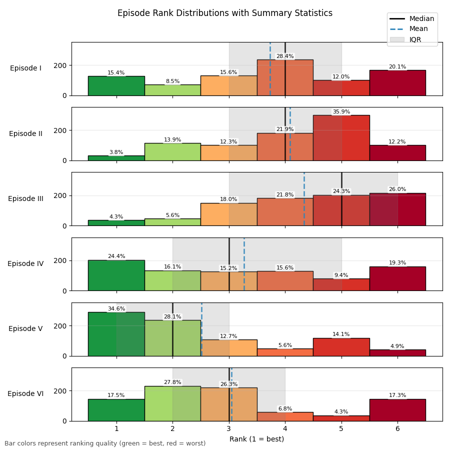
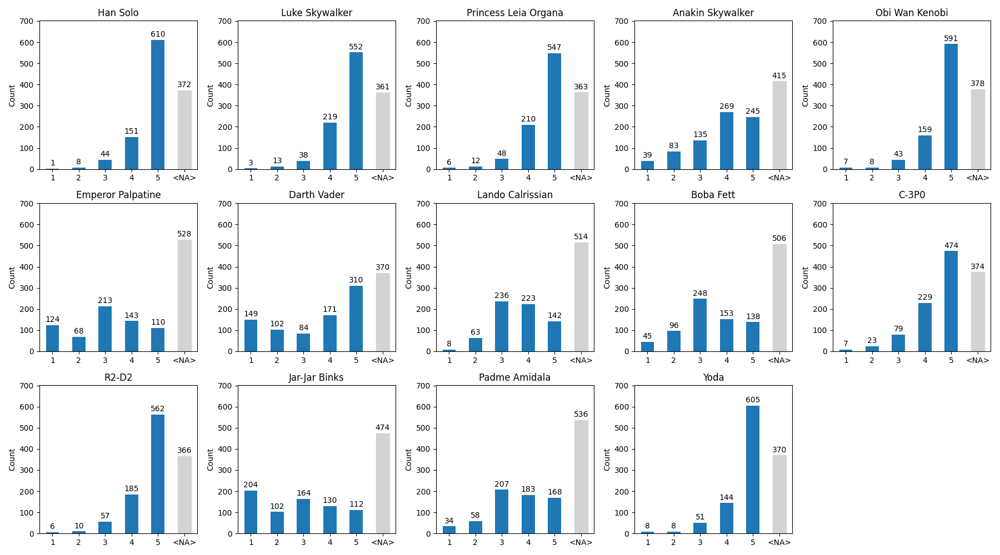
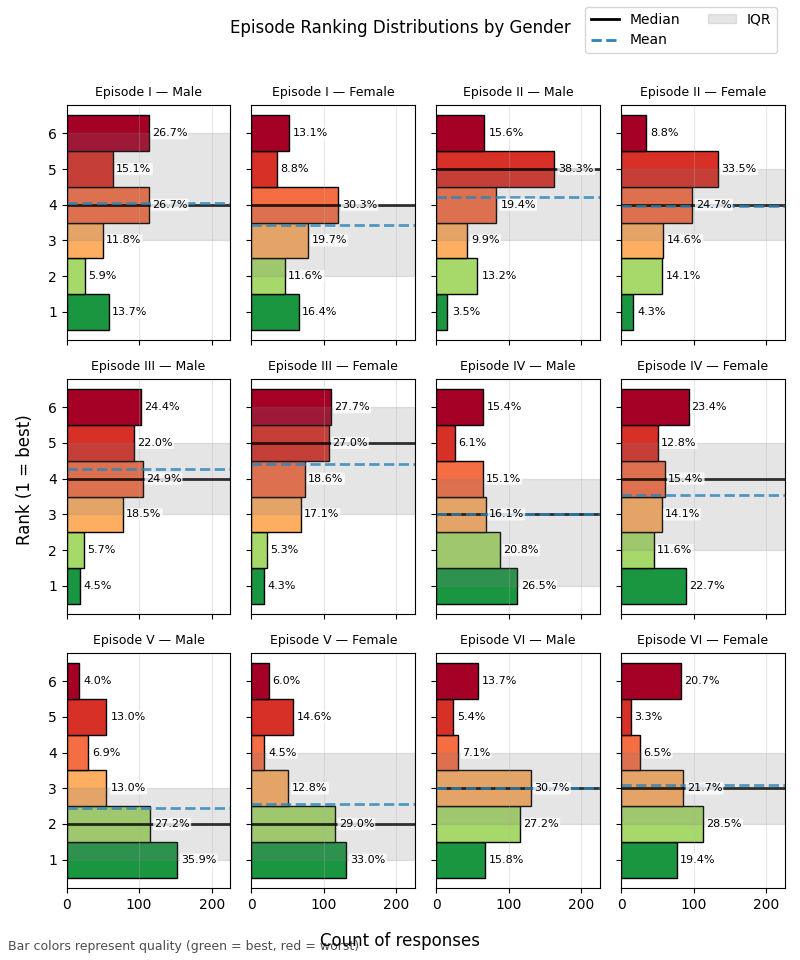

---
# Phase 2 — Bivariate Exploratory Analysis

## Phase 2.1: Binary & Binary / Binary & Nominal Relationships

This phase explores relationships between pairs of binary (boolean) variables.
The goal is **descriptive understanding**, validation of survey logic, and identification of meaningful associations — **not** causal inference or hypothesis testing.

All results are presented as **contingency tables with row-wise percentages**, supported by visual heatmaps (generated but not embedded here).

---
## 2.1.1 Seen Star Wars × Star Wars Fandom

**Variables**

* `seen_star_wars`
* `fan_star_wars`

**Key observations**

* Among respondents who have **not** seen Star Wars, **100%** of responses for `fan_star_wars` are missing.
* Among respondents who **have** seen Star Wars:

  * **59%** identify as Star Wars fans
  * **30%** do not identify as fans
  * **11%** did not answer the fandom question

**Interpretation**

This pattern strongly suggests **structural missingness**: the fandom question is only meaningful for respondents who have seen Star Wars.
No logically impossible combinations (e.g. “fan without having seen”) are observed.

**Conclusion**

* Survey logic is internally consistent.
* The cleaned boolean variables behave exactly as expected.

*(See Figure 2.1: Seen Star Wars × Star Wars Fandom heatmap.)*

---

## 2.1.2 Star Wars Fandom × Star Trek Fandom

**Variables**

* `fan_star_wars`
* `fan_star_trek`

**Key observations**

* Among Star Wars fans:

  * **67%** also identify as Star Trek fans
* Among Star Wars non-fans:

  * Only **16%** identify as Star Trek fans
* Respondents with missing Star Wars fandom responses show high disengagement from fandom questions overall.

**Interpretation**

There is a **strong positive association** between Star Wars fandom and Star Trek fandom.
Rather than being mutually exclusive, the two fandoms substantially overlap.

**Conclusion**

* Sci-fi fandoms appear to cluster within the same respondents.
* This finding motivates later demographic stratification (Phase 2.2).

*(See Figure 2.2: Star Wars Fandom × Star Trek Fandom heatmap.)*

---

## 2.1.3 Seen Star Wars × Star Trek Fandom

**Variables**

* `seen_star_wars`
* `fan_star_trek`

**Key observations**

* Among respondents who have seen Star Wars:

  * Approximately **44%** identify as Star Trek fans
* Among respondents who have not seen Star Wars:

  * Only **~5%** identify as Star Trek fans

**Interpretation**

Exposure to Star Wars is strongly associated with identification as a Star Trek fan.
This may reflect broader engagement with science fiction media rather than franchise-specific preferences.

**Conclusion**

* Sci-fi exposure appears to be a shared trait among respondents.
* Further analysis by demographic groups is warranted.

*(See Figure 2.3: Seen Star Wars × Star Trek Fandom heatmap.)*

---

## Binary & Binary Relationships Summary

Across all binary × binary analyses:

* No logical contradictions were detected
* Structural missingness behaves consistently
* Several strong descriptive associations were identified
* Results validate the earlier data cleaning decisions

This confirms that the dataset is **analysis-ready** for more granular bivariate exploration.

---

Perfect — this is **exactly** the right moment to update the Phase 2 report, and your output is *rich but still manageable*. I’ll help you turn this into **clean, analytical text**, not a data dump.

Below is a **ready-to-drop-in update** for `reports/phase_2_eda.md`.

---

## 2.1.4 Star Wars Fandom by Demographics (`fan_star_wars`)

This section explores how **demographic (nominal) variables** relate to two key binary outcomes:

* `fan_star_wars`
* `fan_star_trek`

For each pairing, row-wise percentages are reported, and stacked bar charts are referenced to visualize relative differences across categories.

**Figure 2.2.1a–e** show the proportion of respondents identifying as Star Wars fans across demographic groups.

#### Gender

Male respondents report a higher likelihood of identifying as Star Wars fans (71.6%) compared to female respondents (59.9%). Respondents with missing gender values show similar fan proportions but are few in number.

#### Education Level

Star Wars fandom is relatively consistent across education levels, ranging from approximately 58% to 67%. Respondents with “Less than High School” education show a 100% fandom rate; however, this category contains very few observations and should not be overinterpreted.

#### Household Income

Fandom rates increase modestly with income. Respondents in the highest income bracket ($150k+) show a higher fan proportion (71.4%) than those in lower income brackets, though differences across income groups are not extreme.

#### Census Region

Regional differences are relatively small. The Pacific region shows the lowest proportion of fans (58.9%), while New England and Mountain regions show higher fandom levels (above 72%). Overall, fandom appears broadly distributed across regions.

#### Age Group

Star Wars fandom peaks among respondents aged 30–44 (72.5%) and declines with age, reaching the lowest level among those aged 60+ (58.5%). This suggests a generational pattern consistent with the original release timeline of the franchise.

---

## 2.1.5 Star Trek Fandom by Demographics (`fan_star_trek`)

**Figure 2.2.2a–e** present the same demographic breakdown for Star Trek fandom, enabling direct comparison with Star Wars.

#### Gender

Male respondents are substantially more likely to identify as Star Trek fans (47.5%) than female respondents (34.1%). This gender gap is notably larger than for Star Wars fandom.

#### Education Level

Star Trek fandom increases with education level. Respondents with some college or higher education show fandom rates above 40%, compared to lower rates among those with high school education or less.

#### Household Income

Star Trek fandom shows a mild positive association with income. Respondents in higher income brackets report slightly higher fandom rates, though differences remain moderate.

#### Census Region

Regional variation is more pronounced for Star Trek than for Star Wars. The East South Central region shows the highest fandom rate (57.9%), while East North Central and Pacific regions report lower levels (around 35%).

#### Age Group

Star Trek fandom increases with age up to the 45–60 group (49.5%) and then declines slightly among respondents aged 60+. This pattern contrasts with Star Wars fandom, which peaks earlier.

---

### 2.1.6 Comparative Observations

Across all demographic dimensions:

* **Star Wars fandom is more prevalent than Star Trek fandom**
* **Star Wars appeals more strongly to younger and middle-aged respondents**
* **Star Trek fandom skews older, more male, and more educated**
* Gender differences are substantially larger for Star Trek than for Star Wars

These descriptive patterns suggest that the two franchises occupy distinct cultural and demographic niches, despite partial audience overlap.

---

## Phase 2.2 Categorical & Ordinal Relationships

## Phase 2.2.1 — Episode Ranking Distributions (Ordinal Analysis)

**Figure 2.2.1.a** show the distribution of each episode rankings with Mean, Median, and IQR.

---

### Key observations

**General**

* Histograms reveal the *full rank distributions* and asymmetries that were partially hidden in boxplots and stacked bars.
* Mean, median, and IQR overlays are consistent with numeric summaries, confirming visual–numeric coherence.

---

**Episode I**

* Rankings are broadly spread, with a noticeable concentration at ranks 4–6.
* Median lies around rank 4, and the wide IQR indicates mixed reception with no strong consensus.

---

**Episode II**

* Strong right skew toward unfavorable rankings (rank 5 dominates).
* Mean and median are both high (worse ranks), reflecting overall negative reception with limited polarization.

---

**Episode III**

* Distribution is concentrated in ranks 4–6, with relatively few top rankings.
* Median and mean are close, indicating consistently low evaluations rather than polarization.

---

**Episode IV**

* Balanced distribution with substantial mass at ranks 1–3.
* IQR is moderate, suggesting generally positive reception with some disagreement among respondents.

---

**Episode V**

* Clear dominance of top rankings (ranks 1–2), visually standing out from all other episodes.
* Median equals rank 2, while the mean is slightly higher (~2.5) due to a small but non-negligible tail of low rankings.
* Narrow IQR confirms strong consensus on high quality.

---

**Episode VI**

* Bimodal tendency: many high rankings (2–3) alongside a visible lower-rank tail.
* Median around rank 3, with a wider spread than Episode V, indicating more divided opinions.

---

### Methodological note

* Histograms provide exact rank frequencies and expose skewness and tail effects that are obscured in summary-only plots.
* Given the inclusion of mean, median, and IQR overlays, histograms subsume the analytical role of both boxplots and stacked bar charts for ordinal comparisons.

---

### Conclusion

* Episode V is the clear consensus favorite.
* Original trilogy episodes (IV–VI) outperform prequels overall but differ in agreement strength.
* Prequel episodes (I–III), especially II and III, show consistently weaker reception rather than polarization.

---

## 2.2.2 Character Rating Distributions

**Figure 2.2.2.a** presents the distribution of ratings for all character variables.

Across all character rating variables, **missingness is substantial (≈30–45%)**, indicating that ratings are conditional on respondent familiarity rather than universally held opinions. This reflects a selection effect rather than random nonresponse.

### Core protagonists

**Luke Skywalker**

* Extremely strong ceiling effect, with a dominant concentration at the highest rating.
* Minimal use of low ratings indicates near-universal positive evaluation among raters.

**Han Solo**

* Similar ceiling effect to Luke, though with slightly more mid-scale usage.
* Distribution suggests broad appeal with limited polarization.

**Princess Leia Organa**

* High concentration at top ratings, with marginally greater dispersion than Luke or Han.
* Indicates strong approval with some differentiation among respondents.

**Yoda**

* Pronounced ceiling effect paired with moderate missingness.
* Ratings suggest iconic status rather than narrative-driven evaluation.

**R2-D2**

* One of the strongest ceiling effects across all characters.
* Extremely limited use of lower ratings implies near-consensus approval.

**C-3P0**

* Still positively skewed, but with noticeably greater mid-scale usage than R2-D2.
* Suggests appreciation tempered by irritation or comedic divisiveness.

---

### Prequel-era and supporting protagonists

**Anakin Skywalker**

* Broad distribution across the full scale.
* Indicates mixed reception, likely reflecting differences between trilogy portrayals.

**Obi-Wan Kenobi**

* Strongly positive skew with less extreme ceiling effects than Luke or Yoda.
* Distribution suggests widespread approval with some evaluative nuance.

**Padmé Amidala**

* Moderate ceiling effect combined with higher missingness.
* Indicates approval among familiar respondents but weaker cultural salience.

**Lando Calrissian**

* Positive skew with visible mid-scale mass.
* Suggests general likability without iconic consensus.

---

### Antagonists and controversial characters

**Darth Vader**

* Broad distribution with substantial mass at both high and mid-scale values.
* Reflects polarized interpretation between admiration and moral negativity.

**Emperor Palpatine**

* Heavily mid- to low-skewed distribution.
* Ratings appear to encode narrative role rather than personal likability.

**Boba Fett**

* Wide dispersion despite limited screen presence.
* Indicates cult popularity alongside indifference among other respondents.

**Jar Jar Binks**

* Strong left skew with dominant low ratings.
* Represents the clearest case of negative consensus in the dataset.

---

### Methodological note

Character ratings exhibit **non-uniform scale usage**, strong **ceiling effects**, and **conditional missingness**. In this context, numeric summaries (mean, median, IQR) would mask polarization and selection effects rather than clarify them. Distributional inspection therefore provides the most faithful descriptive representation.

Overall, these patterns indicate that character ratings capture a mixture of **likability**, **cultural symbolism**, and **narrative role**, which must be considered explicitly in any later comparative or demographic analysis.

---

> These distributional patterns motivate Phase 2.3, where episode rankings and selected character ratings are examined by demographic group, with particular attention to ceiling effects, polarization, and conditional missingness when interpreting group-level differences.

---

## Phase 2.3 — Episode Rankings and Character ratings by Demographic Group

---

# 2.3.1 Episode Ranking Distributions by Gender

**Figure 2.3.1.a** presents episode ranking distributions separately for male and female respondents. Rankings are shown as histograms with overlaid median (solid line), mean (dashed line), and interquartile range (shaded region). Percentages are computed within each episode × gender group.

### Overall structure

Across both genders, the broad ranking hierarchy remains consistent:

* **Episode V** (The Empire Strikes Back) is the dominant entry, with approximately one-third of respondents in both groups assigning it rank 1. Dispersion is low, and the median lies firmly at the top of the scale.
* **Episode II** is consistently among the lowest-ranked films, with large mass at ranks 5 and 6 across both genders.
* The original trilogy (Episodes IV–VI) generally occupies higher ranking positions than the prequel trilogy (Episodes I–III), regardless of gender.

Thus, episode-to-episode variation is substantially larger than gender-based variation.

---

### Episode V: Strong consensus across genders

* Males: 35.9% rank it 1; 63.1% rank it within the top two.
* Females: 33.0% rank it 1; 62.0% rank it within the top two.
* Median is 1 for both groups; IQR tightly concentrated near ranks 1–2.

Gender differences here are minimal, suggesting near-universal cross-gender approval.

---

### Episodes I–III: Modest gender shifts

The prequel trilogy shows slightly more gender differentiation:

**Episode I**

* Females are somewhat less likely to assign the lowest rank (rank 6) compared to males (13.1% vs 26.7%).
* Female distribution is more concentrated in mid-to-lower ranks (3–4).

**Episode II**

* Both groups rank it poorly overall.
* Males show heavier mass at rank 5 (38.3%), while females distribute more evenly across ranks 3–5.

**Episode III**

* Females assign rank 6 slightly more frequently than males (27.7% vs 24.4%).
* Dispersion is similar across groups, with medians around the lower-middle of the ranking scale.

Overall, gender differences for the prequels are present but modest in magnitude relative to the general preference ordering.

---

### Episode IV: Slight polarization among females

* Males: 26.5% assign rank 1.
* Females: 22.7% assign rank 1, but 23.4% assign rank 6.

Female respondents display a somewhat broader distribution, with both high and low extreme rankings more visible. This suggests greater heterogeneity in evaluation rather than a clear directional shift.

---

### Episode VI: Divergence at the extremes

* Males cluster around mid-to-high ranks (2–3), with relatively low mass at rank 6 (13.7%).
* Females show a more bimodal structure, with noticeable mass at both rank 1 (19.4%) and rank 6 (20.7%).

This indicates that Episode VI may generate more polarized reactions among female respondents than male respondents.

---

### Interpretation

Gender differences in episode rankings exist but are secondary to the dominant global preference structure. The hierarchy of episodes—particularly the strong preference for Episode V and the relative weakness of Episode II—remains stable across groups.

Where differences emerge, they primarily reflect **dispersion and polarization effects** rather than complete reversals of ranking order. These patterns suggest that gender influences the intensity and spread of evaluations more than the fundamental ordering of the films.

---

