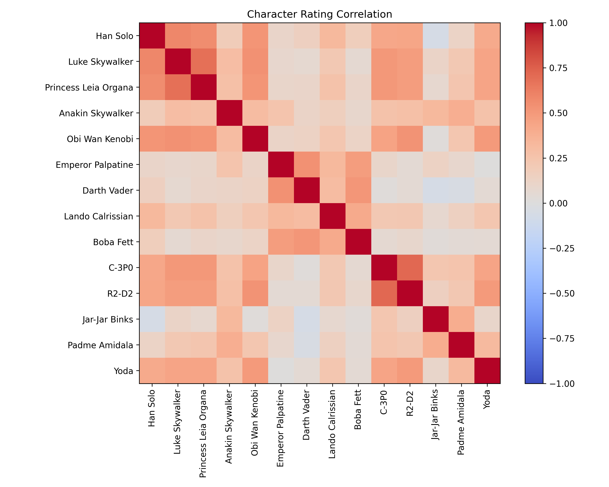
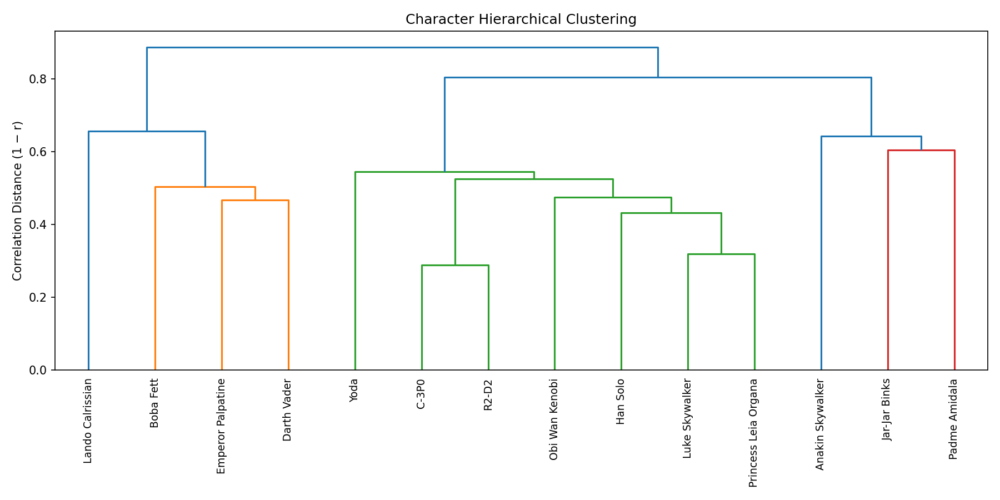
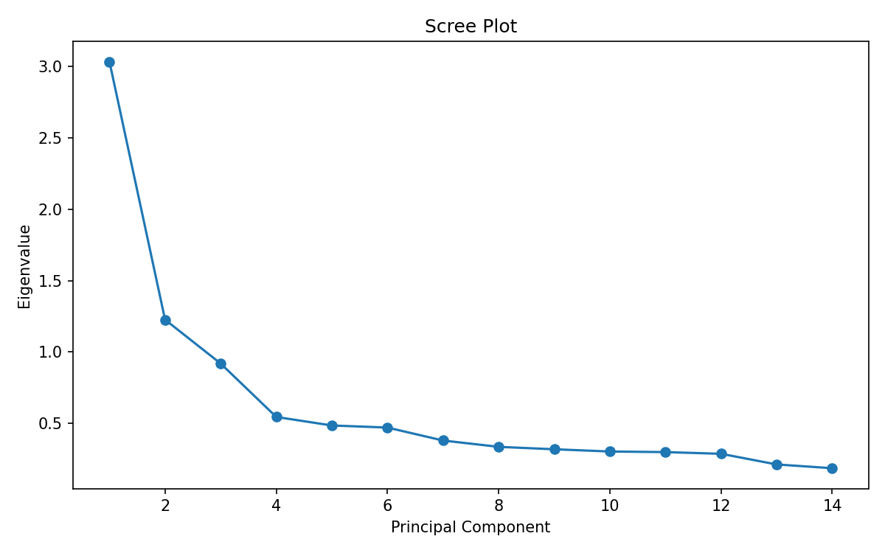
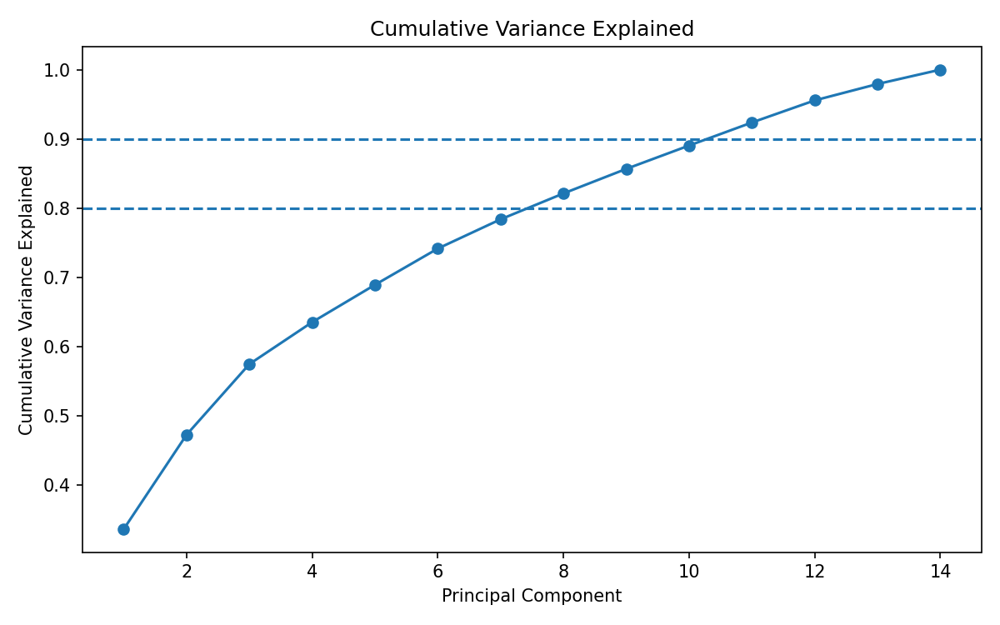
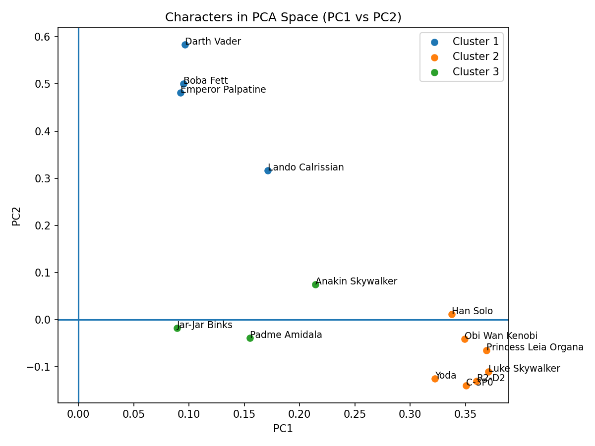
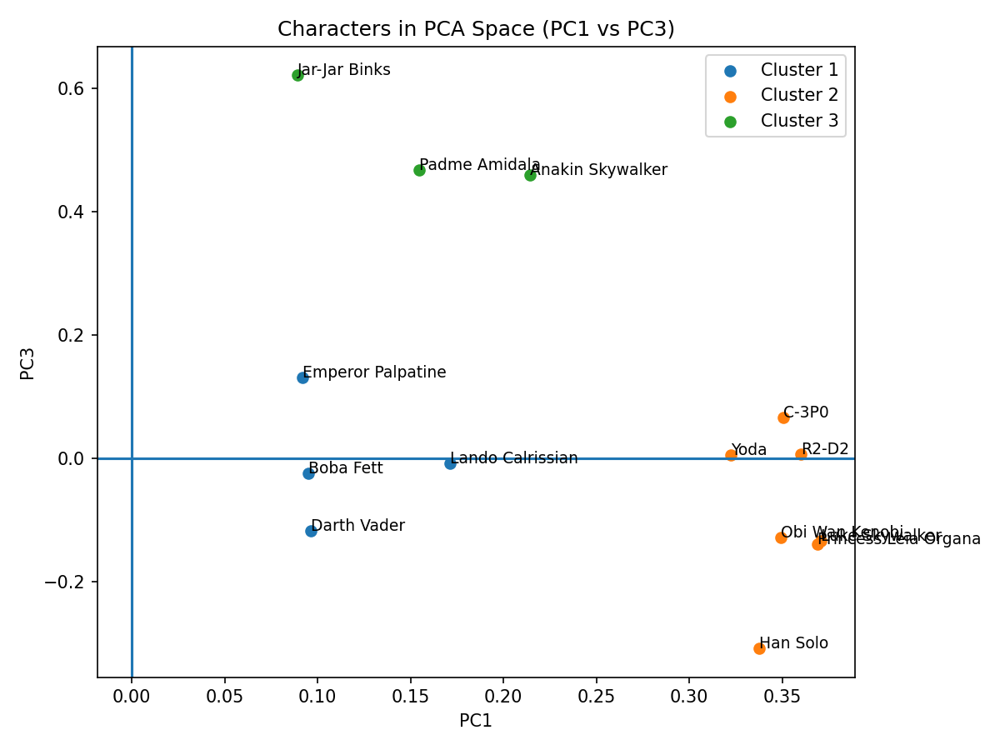

# Phase 3 — Structural Exploration of Character Preferences

## 3.0 Objective

The goal of Phase 3 is to understand the latent structure of character ratings:

* Are preferences random or structured?
* Do characters form coherent blocs?
* How many latent dimensions explain variation?
* Is clustering justified?

This phase uses:

* Correlation analysis
* Hierarchical clustering
* PCA (Principal Component Analysis)
* Cluster validation

---

# 3.1 Correlation Structure

We begin by examining the correlation matrix of character ratings.

## 3.1.1 Interpretation

* Strong positive blocks are clearly visible.
* Characters from similar narrative arcs cluster together.
* Cross-bloc correlations are weaker but not zero.
* The matrix is structured — not noise.

This justifies:

* Using correlation-based distance
* Applying hierarchical clustering
* Expecting meaningful latent dimensions

---

# 3.2 Hierarchical Clustering

Ward linkage was applied to correlation distance.

## 3.2.1 Why Ward?

* Minimizes within-cluster variance
* Produces compact, interpretable clusters
* Appropriate for Euclidean representation

## 3.2.2 Observations

* Three major branches clearly emerge.
* Splits are stable and visually distinct.
* The 3-cluster solution follows visible structural breaks.

Conclusion:

A 3-bloc solution is structurally defensible.

---

# 3.3 Principal Component Analysis (PCA)

PCA was applied to standardized character ratings.

## 3.3.1 Scree Plot

### Interpretation

* Clear elbow after the first 2–3 components.
* PC1 dominates variance.
* PC2 and PC3 contribute meaningful variance.
* Beyond PC4, eigenvalues flatten.

This suggests:

* Structure is not one-dimensional.
* 2–3 dimensions are substantively meaningful.
* Higher components capture residual nuance.

---

## 3.3.2 Cumulative Variance

* Variance accumulates gradually.
* No sharp cutoff.
* Confirms layered preference structure.

---

# 3.4 Cluster Validation in PCA Space

To validate clustering geometrically, cluster assignments were projected onto PCA axes.

## 3.4.1 PC1 vs PC2

### Observations

* Clusters separate primarily along PC1.
* PC2 provides secondary differentiation.
* Overlap exists but is limited.

This confirms clustering reflects real geometric structure.

---

## 3.4.2 PC1 vs PC3

### Observations

* PC3 captures an additional axis.
* Some clusters separate more clearly here.

---

# 3.5 Quantitative Cluster Validation

To evaluate clustering robustness (k = 3), we assess:

* Separation strength (Silhouette score)
* Stability under resampling (Bootstrap ARI)
* Sensitivity to imputation method

---

## 3.5.1 Silhouette Score

Silhouette score was computed using Euclidean distance on KNN-imputed data.

**Silhouette score: 0.175**

### Interpretation

* Indicates modest but non-random separation.
* Clusters are partially overlapping.
* Consistent with PCA visualizations.
* Typical magnitude for human preference data.

Conclusion:

Clusters are distinguishable but not sharply segmented.

---

## 3.5.2 Bootstrap Stability

Clustering was recomputed across 100 bootstrap resamples.

Similarity to the original clustering was measured using Adjusted Rand Index (ARI).

**Mean ARI: 0.998**

### Interpretation

* Extremely high stability.
* Assignments are nearly invariant under resampling.
* Structure is not driven by sampling noise.

Conclusion:

The clustering solution is highly stable.

---

## 3.5.3 Imputation Sensitivity

Validation was performed under:

* Column mean imputation
* KNN imputation

Results were consistent:

* Silhouette slightly improved under KNN
* ARI remained near 1.0

Conclusion:

The cluster structure is robust to reasonable preprocessing choices.

---

# 3.6 Structural Conclusions

From Sections 3.1–3.5:

1. Preferences are structured, not random.
2. Three coherent character blocs emerge.
3. Structure is continuous rather than categorical.
4. Dimensionality is layered:

   * PC1: dominant polarity
   * PC2: secondary alignment
   * PC3: additional nuance
5. Clustering is geometrically justified.
6. The solution is quantitatively stable and robust.

---

