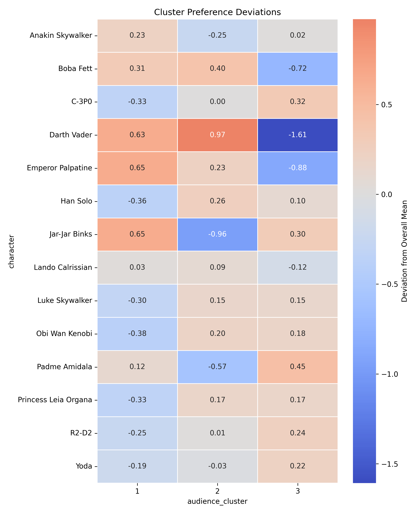
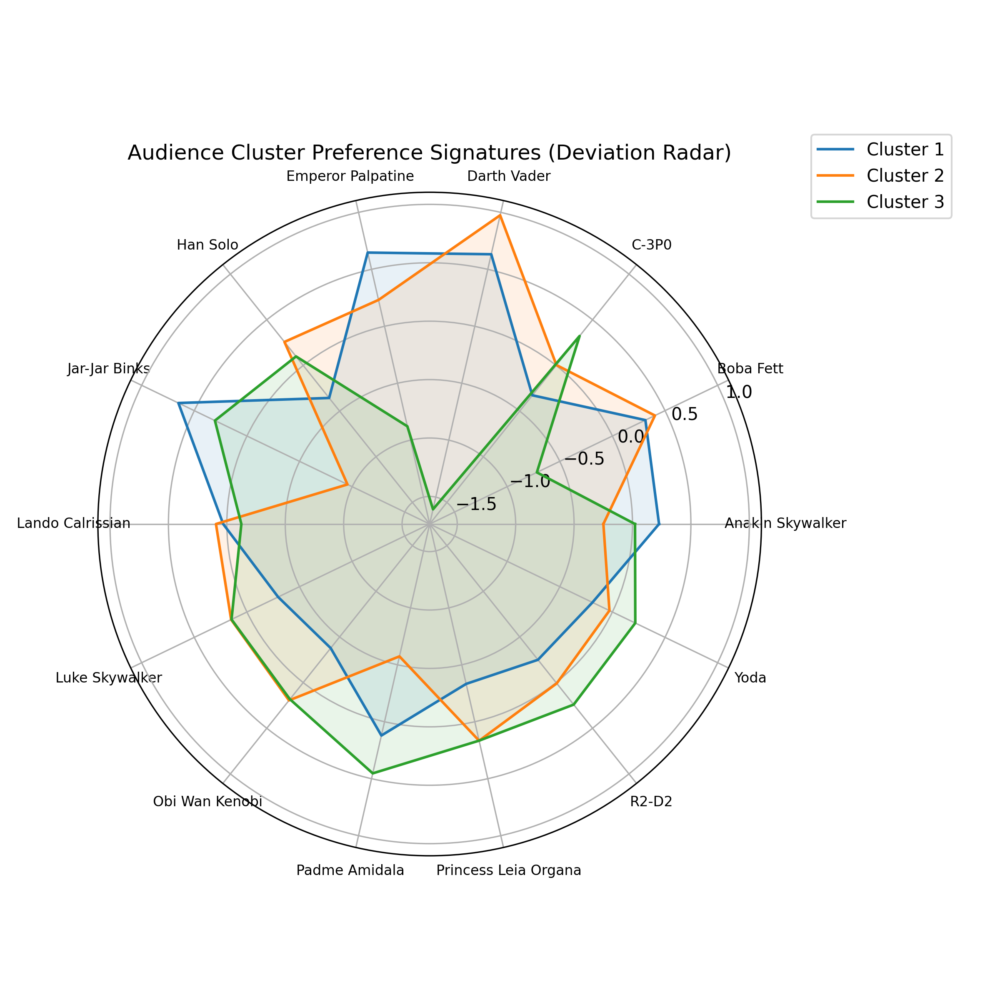

# Phase 4.2 — Structural Interaction Analysis

### Audience–Narrative Alignment and the Ideological Geometry of Star Wars Character Preferences

---

# 1. Introduction

Phase 4.1 established that the Star Wars audience is not homogeneous.
Instead, the data reveals **three distinct audience clusters** that interpret the narrative differently.

The goal of Phase 4.2 is to examine the **interaction between audience clusters and narrative archetypes**.

Rather than analyzing characters individually, we analyze the **structural interaction between two systems**:

1. **Audience identities** (clusters of respondents)
2. **Narrative archetypes** (clusters of characters)

This produces a **3 × 3 interaction matrix** describing how each audience identity evaluates each narrative archetype.

This structural analysis reveals:

* ideological alignments
* narrative rejection patterns
* the deep polarization structure of the fandom.

---

# 2. Audience–Narrative Interaction Matrix

The core dataset for this phase is the **mean rating of each character cluster by each audience cluster**.

### Table 1 — Audience × Character Cluster Matrix

| Audience Cluster | Villain Archetype (C1) | Hero Archetype (C2) | Prequel Archetype (C3) |
| ---------------- | ---------------------- | ------------------- | ---------------------- |
| Cluster 1        | 3.704                  | 4.289               | 3.779                  |
| Cluster 2        | 3.725                  | 4.701               | 2.863                  |
| Cluster 3        | 2.398                  | 4.789               | 3.697                  |

Interpretation:

* All clusters strongly like **heroic characters**.
* Clusters diverge strongly on **villain characters**.
* Prequel characters generate **mixed responses**.

However, raw values alone do not reveal structural bias.
To measure bias, we compare each block to the **global archetype mean**.

---

# 3. Block Deviations from Global Archetype Means

The deviation of each block from the global mean captures **how strongly a cluster favors or rejects a narrative archetype**.

### Table 2 — Block Deviations

| Audience Cluster | Archetype | Deviation  |
| ---------------- | --------- | ---------- |
| Cluster 1        | Villains  | +0.429     |
| Cluster 1        | Heroes    | −0.304     |
| Cluster 1        | Prequels  | +0.332     |
| Cluster 2        | Villains  | +0.449     |
| Cluster 2        | Heroes    | +0.108     |
| Cluster 2        | Prequels  | **−0.583** |
| Cluster 3        | Villains  | **−0.878** |
| Cluster 3        | Heroes    | +0.196     |
| Cluster 3        | Prequels  | +0.250     |

The magnitude of these deviations reveals **clear ideological alignments**.

---

# 4. Statistical Significance

Bootstrap confidence intervals confirm that **all structural deviations are statistically significant**.

### Table 3 — Bootstrap Significance

| Cluster | Archetype | Deviation  | CI               |
| ------- | --------- | ---------- | ---------------- |
| C1      | Villains  | +0.429     | [0.339, 0.515]   |
| C1      | Heroes    | −0.304     | [−0.358, −0.248] |
| C2      | Prequels  | **−0.583** | [−0.658, −0.503] |
| C3      | Villains  | **−0.878** | [−0.947, −0.805] |

All deviations remain significant under resampling, confirming that these patterns reflect **real audience structures rather than sampling noise**.

---

# 5. Visualization of Structural Alignment

## Deviation Heatmap

This heatmap shows the magnitude of structural bias.

*(Plot: reports/figures/phase4/deviation_heatmap.png)*

Key patterns visible in the heatmap:

* **Deep red rejection of villains by Cluster 3**
* **Strong rejection of prequel characters by Cluster 2**
* **Cluster 1 remaining relatively balanced**

The heatmap reveals the **ideological geometry of the fandom**.

---

## Cluster Radar Profiles

*(Plot: reports/figures/phase4/cluster_radar_plots.png)*

Radar profiles illustrate how each audience cluster evaluates the narrative archetypes.

Interpretation:

Cluster 1 shows a **broad triangular profile**, reflecting balanced engagement.

Cluster 2 shows a **hero-dominant spike**, reflecting strong attachment to the heroic core.

Cluster 3 shows a **sharp anti-villain drop**, reflecting ideological rejection.

---

# 6. Structural Archetypes of the Audience

Using deviation patterns, we classify clusters into **narrative identity archetypes**.

### Table 4 — Structural Identity Typology

| Cluster | Identity Type    | Structural Profile        |
| ------- | ---------------- | ------------------------- |
| 1       | Broad Mainstream | Balanced engagement       |
| 2       | Cult Archetype   | Rejects prequel archetype |
| 3       | Cult Archetype   | Rejects villain archetype |

These identity types represent **distinct ways of interpreting the Star Wars narrative**.

---

# 7. Structural Tension in the Narrative

We compute **variance across audience clusters for each archetype**.

### Table 5 — Narrative Tension

| Archetype | Variance  | Std Dev |
| --------- | --------- | ------- |
| Villains  | **0.578** | 0.760   |
| Prequels  | 0.257     | 0.506   |
| Heroes    | 0.071     | 0.267   |

Interpretation:

The narrative axis producing the **most conflict** is **villain characters**.

Hero characters generate **almost universal agreement**.

---

# 8. The Most Surprising Result

The most surprising structural finding is the **magnitude of villain rejection in Cluster 3**.

Cluster 3 rates villain archetype characters:

**2.40**

Global mean:

**3.28**

Deviation:

**−0.88**

This is the **largest structural deviation in the entire audience–narrative matrix**.

This result suggests that a substantial portion of the fandom **rejects the mythic villain archetype entirely**.

In many fandoms, villains are admired as complex or charismatic figures.
However, this cluster treats villains not as mythic characters but as **morally unacceptable figures**.

This produces the **sharpest ideological divide in the fandom**.

---

# 9. Narrative Identity Reports

The final structural identity reports summarize the clusters.

### Cluster 1 — Broad Mainstream

Balanced engagement across narrative archetypes.

Fans in this group appear to enjoy the story as a **complete narrative universe**.

---

### Cluster 2 — Cult Archetype (Original Trilogy Loyalists)

Strong preference for heroic characters and strong rejection of prequel characters.

This audience likely formed its fandom identity around the **original trilogy narrative structure**.

---

### Cluster 3 — Cult Archetype (Moral Purists)

Strong rejection of villain characters and elevated admiration for heroes.

This group interprets Star Wars primarily as a **moral narrative rather than a mythic saga**.

---

# 10. Structural Interpretation

The Star Wars fandom is not divided by demographics but by **narrative interpretation frameworks**.

Three interpretive models emerge:

### Mythic Engagement

Fans enjoy all archetypes, including villains.

### Canonical Loyalty

Fans prefer characters associated with the original trilogy.

### Moral Narrative

Fans reject villains and celebrate heroes.

These frameworks explain **why certain characters provoke strong reactions** within the fandom.

---

# 11. Conclusion

Phase 4.2 reveals the **structural geometry of audience interpretation**.

The Star Wars fandom divides into three narrative identities:

1. **Broad Mainstream audiences** who engage with all narrative archetypes
2. **Original-trilogy loyalists** who reject prequel-era characters
3. **Moral purists** who reject villain archetypes

The strongest ideological conflict in the fandom occurs around **villain characters**, revealing a deep disagreement over whether these figures should be admired or condemned.

These results demonstrate that audience segmentation in narrative media is driven primarily by **interpretive frameworks rather than demographics**.

---

