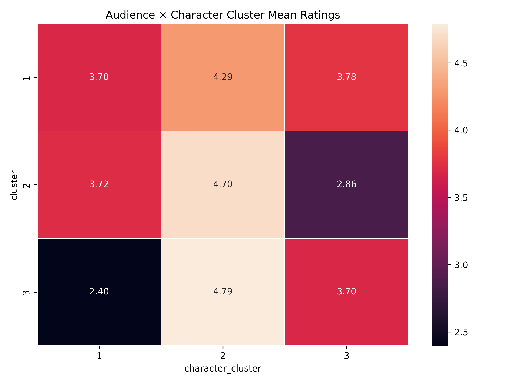
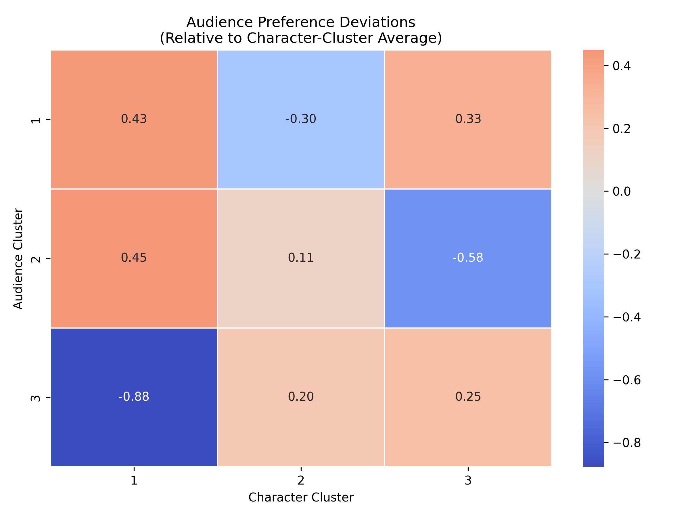
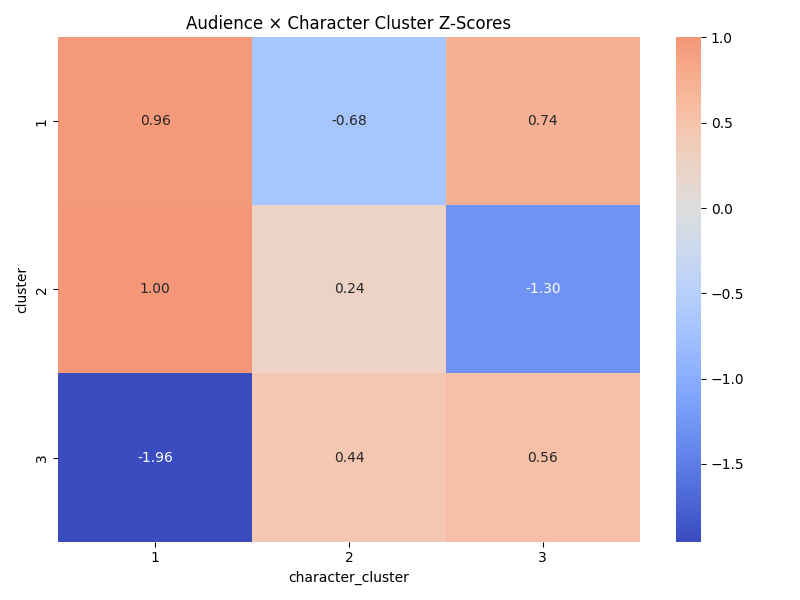
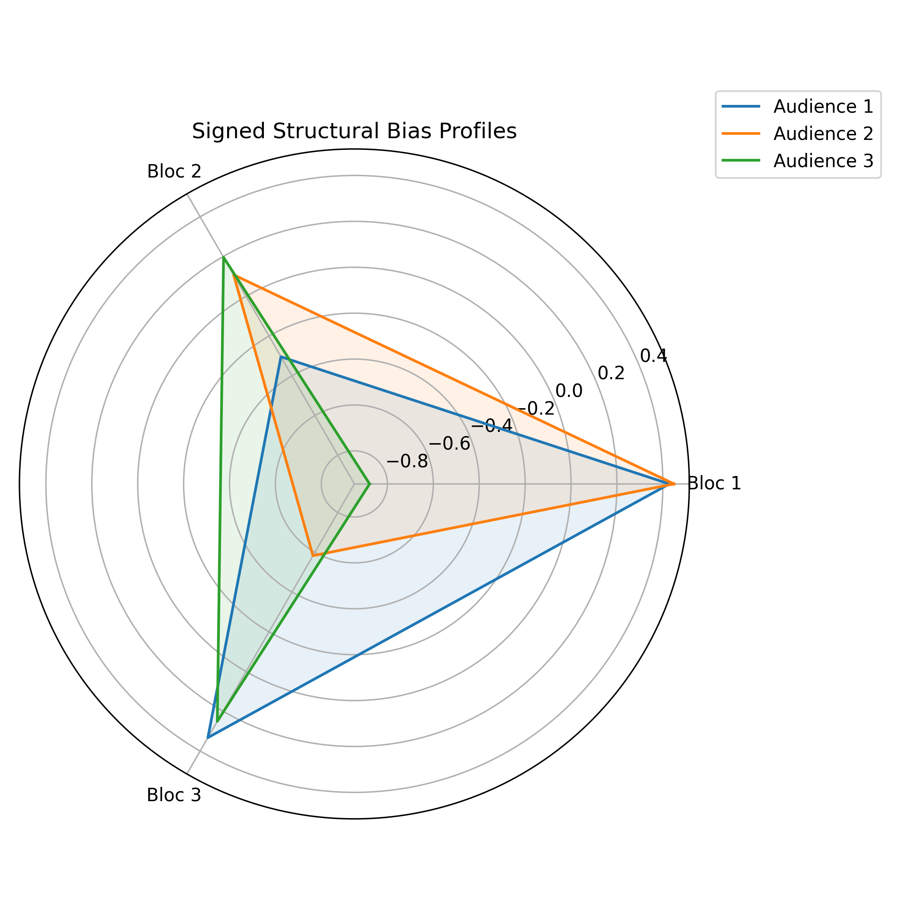

# Phase 4.2 — Structural Interaction Between Audience Segments and Narrative Archetypes

## 4.2.1 Objective

Phase 3 identified:

* Three **Audience Clusters**
* Three **Character Archetype Clusters**:

  * Cluster 1 — Villain Bloc
  * Cluster 2 — Core Hero Bloc
  * Cluster 3 — Prequel-Era Bloc

Phase 4.2 evaluates how these two structures interact.

Rather than analyzing individual characters, we collapse ratings into archetypal blocks and measure:

1. Block-level means
2. Deviations from global archetype baselines
3. Standardized effect sizes (z-scores)
4. Bootstrap confidence intervals
5. Structural polarization patterns

All outputs for this section are stored under:

```
reports/tables/phase4/
reports/figures/phase4/
```

---

# 4.2.2 Audience × Character-Cluster Mean Matrix

**Source table:**
`reports/tables/phase4/audience_character_cluster_means.csv`

**Visualization:**
`reports/figures/phase4/audience_character_cluster_heatmap.png`

### Mean Ratings

| Audience Cluster | Villains | Core Heroes | Prequels |
| ---------------- | -------- | ----------- | -------- |
| Cluster 1        | 3.70     | 4.29        | 3.78     |
| Cluster 2        | 3.72     | 4.70        | 2.86     |
| Cluster 3        | 2.40     | 4.79        | 3.70     |

### Interpretation

The heatmap makes one fact immediately visible:

All clusters strongly endorse the Hero Bloc.

Polarization does not live in hero evaluation.

It lives in:

* Villain tolerance
* Prequel legitimacy

This is already evidence of ideological differentiation.

---

# 4.2.3 Structural Deviations from Archetype Baselines

**Source table:**
`reports/tables/phase4/block_deviations.csv`

**Visualization:**
`reports/figures/phase4/audience_character_cluster_deviation_heatmap.png`

Global archetype means:

* Villains: 3.276
* Heroes: 4.593
* Prequels: 3.446

### Deviations

| Audience  | Villains | Heroes | Prequels |
| --------- | -------- | ------ | -------- |
| Cluster 1 | +0.43    | -0.30  | +0.33    |
| Cluster 2 | +0.45    | +0.11  | -0.58    |
| Cluster 3 | -0.88    | +0.20  | +0.25    |

The deviation heatmap reveals strong color separation across clusters.

This is not gradual variation.

It is structured alignment.

---

# 4.2.4 Standardized Polarization (Z-Scores)

**Source table:**
`reports/tables/phase4/block_zscores.csv`

**Visualization:**
`reports/figures/phase4/block_zscore_heatmap.png`

Key standardized effects:

* Cluster 3 → Villains: z = -1.96
* Cluster 2 → Prequels: z = -1.30
* Cluster 1 → Villains: z = +0.96

Interpretation:

Cluster 3 exhibits near two-standard-deviation rejection of villains.

That is not mild taste difference.

That is ideological distancing.

The z-score heatmap visually amplifies this effect —
Cluster 3’s villain cell dominates the matrix.

---

# 4.2.5 Bootstrap Structural Significance

**Source table:**
`reports/tables/phase4/bootstrap_block_significance.csv`

All deviations have bootstrap confidence intervals excluding zero.

Example:

* Cluster 3 → Villains:
  CI [-0.947, -0.805]

* Cluster 2 → Prequels:
  CI [-0.658, -0.503]

* Cluster 1 → Villains:
  CI [0.339, 0.515]

Every single block deviation is statistically significant.

This confirms:

The interaction structure is stable, not sampling noise.

---

# 4.2.6 Radar Profiles: Archetype Alignment Signatures

**Visualization:**
`reports/figures/phase4/block_radar_plot.png`

The radar plot makes ideological shape visible:

* Cluster 3 forms a sharp triangular moral structure:

  * High Heroes
  * Moderate Prequels
  * Strong Villain rejection

* Cluster 2 shows:

  * Hero alignment
  * Villain tolerance
  * Prequel collapse

* Cluster 1 shows:

  * Villain and Prequel warmth
  * Lower hero intensity

These are not random shapes.

They are archetype signatures.

---

# 4.2.7 Ideological Interpretation

## Cluster 1 — The Narrative Pluralists

* Elevated Villain appreciation
* Elevated Prequel appreciation
* Reduced Hero intensity

This cluster appears comfortable with ambiguity.

They do not over-index on moral polarity.

They treat villains as charismatic figures, not ethical boundaries.

---

## Cluster 2 — The Canon Traditionalists

* Strong Hero endorsement
* Villain tolerance
* Strong Prequel rejection

This cluster defends canonical boundaries.

Their strongest signal is Prequel exclusion.

This is era-based legitimacy filtering.

---

## Cluster 3 — The Moral Absolutists

* Extreme Villain rejection
* Strong Hero alignment
* Positive Prequel stance

Cluster 3 is the most polarized group.

Their narrative engagement appears organized around moral clarity.

They draw the strongest boundary between good and evil.

---

# 4.2.8 Polarization Axes

Two major structural axes emerge:

### Axis 1: Moral Boundary Intensity

Driven by Villain evaluation.

Cluster 3 is farthest from Clusters 1 and 2.

### Axis 2: Canon Legitimacy

Driven by Prequel evaluation.

Cluster 2 stands apart.

These axes form a structured ideological space.

Audience clusters are not merely rating levels.

They are narrative identity positions.

---

# 4.2.9 Structural Conclusion

Phase 4.2 demonstrates that:

* Audience segmentation maps directly onto narrative archetypes.
* Differences are large, significant, and coherent.
* The fandom contains identifiable ideological blocs.

We do not observe random taste variation.

We observe structured symbolic alignment.

This confirms that segmentation in this dataset reflects:

* Moral positioning
* Era legitimacy judgments
* Archetype alignment systems

Phase 4.2 therefore establishes that audience clusters represent stable narrative ideologies rather than arbitrary rating groupings.

---


