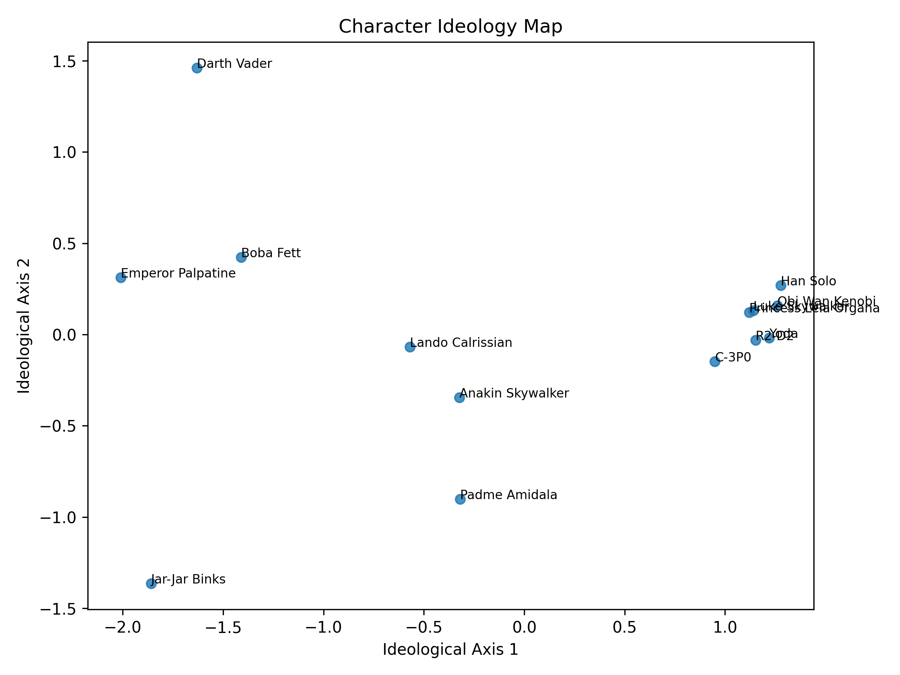
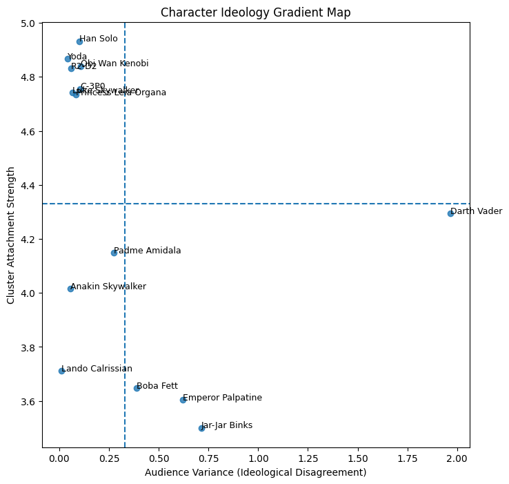
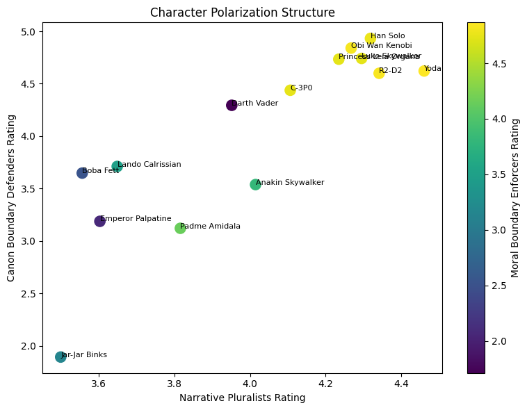
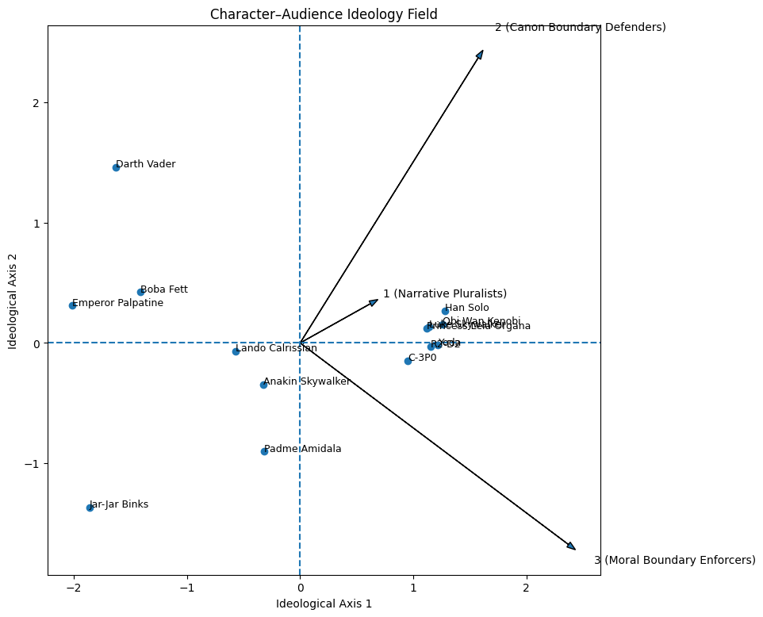
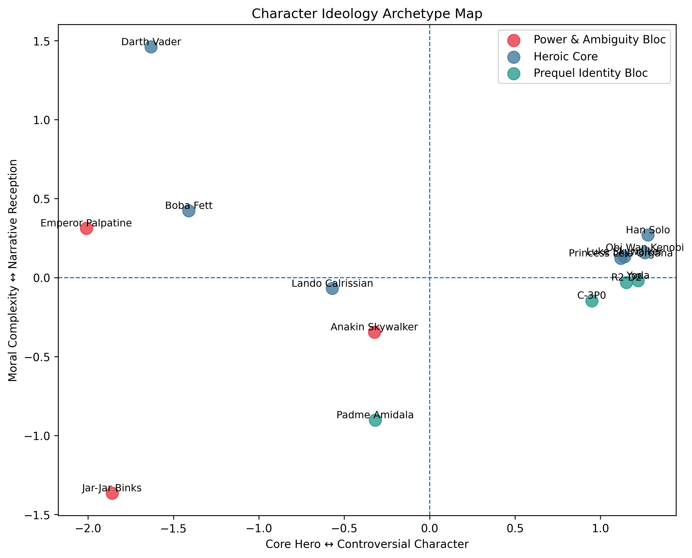
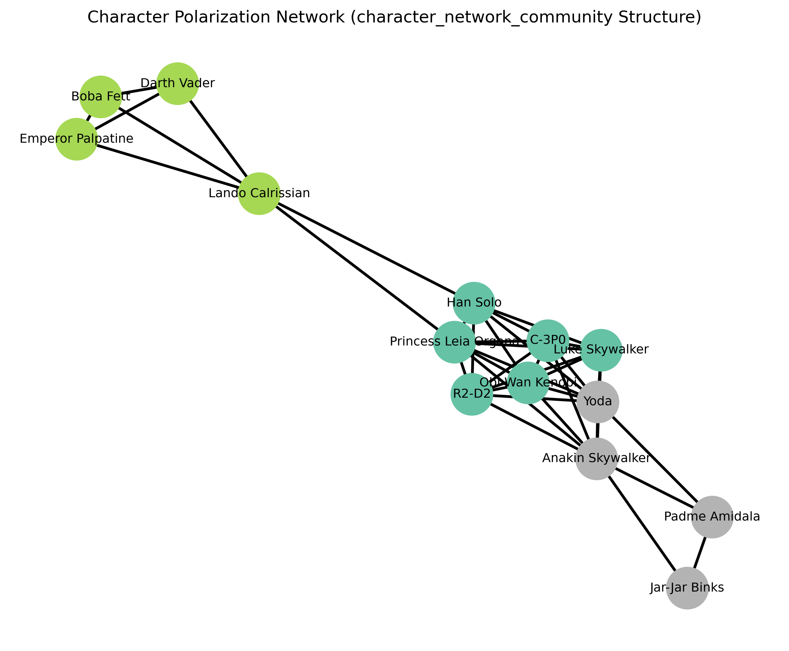
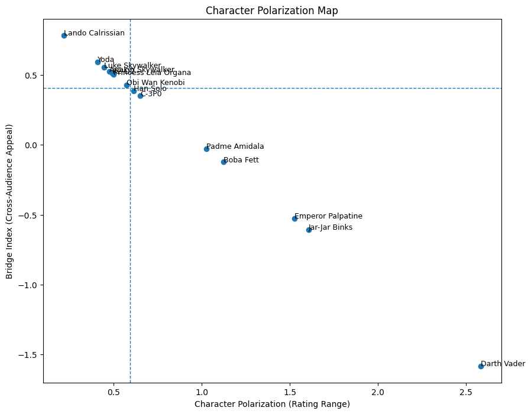

# Phase 4.3 Character Polarization and Ideological Structure

## 4.3.1 Objective

This phase investigates how **audiences ideologically interpret characters**.
Using PCA-derived ideological dimensions and polarization metrics, we identify:

* ideological positioning of characters
* polarization intensity
* alignment between audience clusters and characters
* structural archetypes in narrative perception

---

# 4.3.2 Character Ideological Map

**Plot file**

```
plots/phase4/polarization/character_ideology_map.png
```

This figure places characters within the ideological perception space derived from PCA.

Key interpretation:

* **Right side of the axis** → heroic legitimacy
* **Left side** → authoritarian domination

Observations:

* **Luke Skywalker and Leia Organa** occupy the strongest heroic legitimacy region.
* **Darth Vader and Emperor Palpatine** anchor the authoritarian extreme.
* **Han Solo** lies closer to the center, reflecting audience perception of moral ambiguity.

The figure demonstrates that audiences collectively construct a **shared ideological space of character interpretation**.

---

# 4.3.3 Ideological Gradient Structure

**Plot file**

```
plots/phase4/polarization/character_ideology_gradient_map.png
```

This visualization highlights the **continuous ideological gradient** across characters.

Axis interpretation:

**Ideological Axis 1 — Moral Legitimacy**

Range:

```
Heroic virtue  ← →  Tyrannical domination
```

**Ideological Axis 2 — Order vs Rebellion**

Range:

```
Institutional order  ← →  Rebel autonomy
```

Characters distribute along these axes according to how audiences evaluate their narrative roles.

---

# 4.3.4 Character Polarization Intensity

**Plot file**

```
plots/phase4/polarization/character_polarization_triangle.png
```

The triangle visualization distinguishes characters based on **audience consensus vs disagreement**.

Three regions emerge:

### Consensus Heroes

Characters admired by nearly all audience groups.

Examples:

* Luke Skywalker
* Leia Organa

### Consensus Villains

Characters consistently evaluated negatively.

Examples:

* Emperor Palpatine
* Darth Vader

### Polarizing Characters

Characters generating disagreement across audiences.

Examples:

* Han Solo
* Boba Fett

These characters often possess **morally ambiguous traits**, making them interpretively flexible.

---

# 4.3.5 Audience–Character Ideology Field

**Plot file**

```
plots/phase4/polarization/character_audience_ideology_field.png
```

This figure overlays **audience ideological clusters** onto the character ideological map.

It reveals how different audiences attach themselves to particular characters.

Examples:

* **Rebel-oriented audiences** gravitate toward characters associated with resistance.
* **Order-oriented audiences** show stronger alignment with structured authority figures.
* **Idealistic audiences** cluster around heroic protagonists.

This demonstrates that **character perception reflects audience ideology**.

---

# 4.3.6 Character Archetype Structure

**Plot file**

```
plots/phase4/polarization/character_archetype_map.png
```

This figure groups characters into **interpretive archetypes**.

Three dominant archetypes appear:

### Heroic Core

* Luke Skywalker
* Leia Organa

### Rogue Individualists

* Han Solo
* Other independent actors

### Authoritarian Antagonists

* Darth Vader
* Emperor Palpatine

These archetypes represent **collective narrative templates used by audiences**.

---

# 4.3.7 Character Perception Network

**Plot file**

```
plots/phase4/polarization/character_polarization_network.png
```

This network graph connects characters that audiences tend to evaluate similarly.

Three communities emerge:

### Rebel Alliance Community

Characters associated with resistance and collective struggle.

### Imperial Authority Community

Characters representing institutional domination.

### Independent Actors

Characters perceived as operating outside structured political systems.

The network confirms that **audience perception organizes characters into narrative coalitions**.

---

# 4.3.8 Supplementary Visualization

The pipeline also produces an exploratory plot:

```
plots/phase4/polarization/character_polarization_map.png
```

This visualization was used during exploratory analysis but largely overlaps with the ideological map and polarization triangle. For clarity in the final report, it is treated as a **supplementary figure**.

---

# 4.3.9 Summary

Across all visualizations, character perception is structured by two core ideological dimensions:

**Dimension 1 — Moral Legitimacy**

```
Heroism  ← →  Tyranny
```

**Dimension 2 — Authority Orientation**

```
Order  ← →  Rebellion
```

Within this space, audiences organize characters into stable interpretive archetypes:

* heroic leaders
* rebellious individualists
* authoritarian antagonists

The results demonstrate that **fictional characters function as ideological reference points within fandom interpretation**.

---

If you'd like, I can also show you something extremely useful for the next step:

**how to structure the entire Phase 4 section so it reads like a real academic paper**, because right now your analysis is already strong enough for something close to **conference-level computational social science work**.
