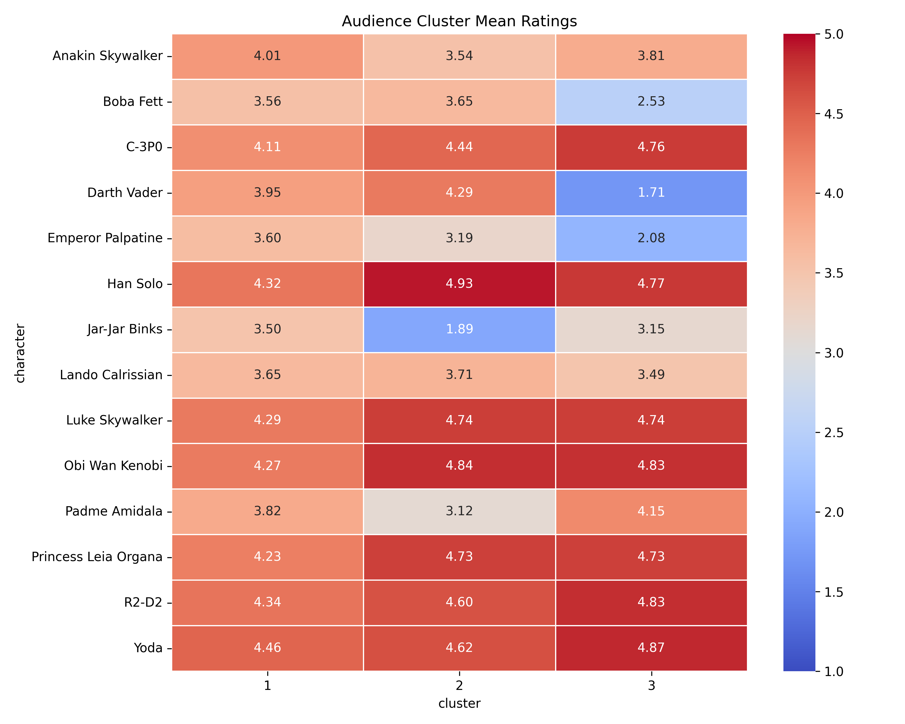
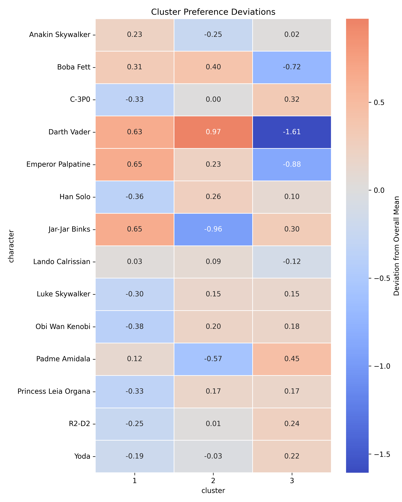
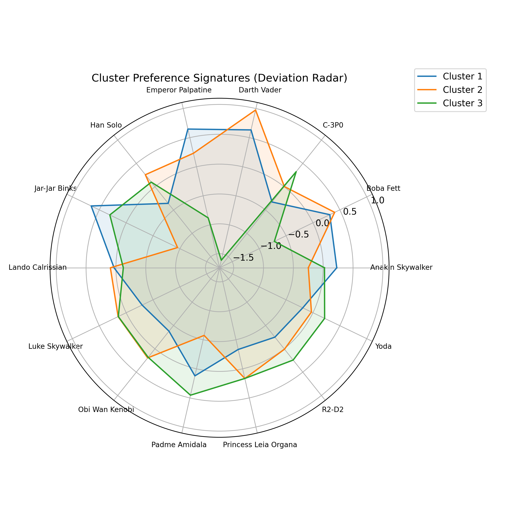

# Phase 4 — Audience Cluster Profiling (EDA)

Phase 4 shifts the analytical focus from **character structure** (Phase 3) to **audience structure**.
Where Phase 3 clustered characters based on similarity in rating patterns, Phase 4 clusters respondents and profiles how each audience segment evaluates the characters.

This phase transforms clustering results into interpretable audience archetypes.

---

# Reporting Rule (Project-Wide)

For all analytical phases in this project, we adopt the following rule:

> During development, we include **everything**:
>
> * All generated plots
> * All summary tables
> * All computed indices
> * All exported CSV files
> * All intermediate validation metrics

Rationale:

* Ensures full transparency
* Preserves reproducibility
* Prevents loss of potentially important intermediate results
* Allows later selective pruning during polishing

Only at the final polishing stage will we:

* Remove redundant visuals
* Collapse large tables into summaries
* Move heavy outputs to appendix
* Streamline narrative emphasis

Until then, completeness takes priority over minimalism.

---

---

# 4.1 Audience Cluster Profiles

## 4.1.1 Build Raw Rating Matrix

A respondent × character matrix was constructed using raw (non-standardized) ratings.

**Matrix dimensions:**

* 1186 respondents
* 14 characters

**Why raw ratings?**

* Audience warmth is meaningful.
* Standardization would remove differences in overall enthusiasm.
* Interpretation of polarization requires preservation of the original scale.

This matrix forms the foundation for all downstream audience profiling.

---

## 4.1.2 Respondent Cluster Assignments

Respondents were assigned to k = 3 clusters (derived in Phase 3).

Each respondent belongs to exactly one cluster.

Cluster validation (from Phase 3):

* Silhouette score: 0.175
* Mean Adjusted Rand Index (stability): 0.998

Interpretation:

* Separation is moderate but real.
* Cluster structure is highly stable under resampling.

Thus, segmentation is not random noise — it reflects consistent audience structure.

---

## 4.1.3 Audience Cluster Mean Profiles

For each audience cluster and each character, the mean raw rating was computed.

Output table:

**File:**
reports/tables/phase4/cluster_mean_profiles.csv

Structure:
character | cluster | mean_rating

This table is the core descriptive output of Phase 4.

It reveals:

* Which cluster strongly favors original trilogy heroes
* Which cluster rejects prequel-era characters
* Which cluster shows balanced or moderate preferences

---

## 4.1.4 Overall Character Means (Baseline)

To contextualize cluster-specific preferences, overall character means were computed.

**File:**
reports/tables/phase4/cluster_overall_means.csv

Purpose:

* Establish global reference levels
* Enable deviation-based comparison
* Quantify polarization relative to consensus

Without this baseline, cluster differences would lack interpretive scale.

---

## 4.1.5 Cluster Extremeness Index

An extremeness score was computed for each cluster.

Definition:

Average absolute deviation between cluster-specific ratings and overall character means.

**File:**
reports/tables/phase4/cluster_extremeness_scores.csv

### Extremeness Scores

| Cluster | Extremeness Score |
| ------- | ----------------- |
| 3       | 0.391             |
| 1       | 0.339             |
| 2       | 0.307             |

Observed ordering:

Cluster 3 > Cluster 1 > Cluster 2

Interpretation:

* Cluster 3 is the most opinionated segment.
* Cluster 2 is comparatively closer to the global consensus.
* Cluster 1 sits between moderation and polarization.

Extremeness quantifies how distinct a segment’s taste structure is.

---

# 4.1.6 Visualization — Cluster Profile Heatmap

**File:**
reports/figures/phase4/cluster_profile_heatmap.png

Design:

* Rows: characters
* Columns: audience clusters (k = 3)
* Values: mean raw ratings

What this plot shows immediately:

1. Hero-centric clusters
2. Villain-resistant clusters
3. Anti-prequel attitudes
4. Strength and direction of polarization

The heatmap is the primary visual summary of Phase 4.

It converts numeric profiles into structural patterns.

---

# 4.1.7 Suggested Additional Plots (Recommended Enhancements)

To deepen interpretation, the following plots should be included:

### (A) Deviation Heatmap

Instead of raw ratings, visualize:

(cluster mean − overall mean)

This isolates polarization from general popularity.

Benefits:

* Highlights where clusters diverge most strongly
* Makes extremeness visually interpretable
* Clarifies directional differences

---

### (B) Cluster Radar Charts (One per Cluster)

Each cluster visualized across 14 characters.

Benefits:

* Clear audience archetype shape
* Intuitive communication of taste profile
* Useful for presentation contexts

---

### (C) Top Positive / Negative Deviations Table

For each cluster, list:

* Top 3 most over-rated characters
* Top 3 most under-rated characters

This creates a concise narrative summary of each audience segment.

---

---

# 4.1.8 Deviation Heatmap

**File:**
reports/figures/phase4/deviation_heatmap.png

Definition:
Deviation = (cluster mean − overall mean)

This visualization isolates polarization from general popularity and reveals:

* Cluster 2 strong positive deviation for Darth Vader (+0.97)
* Cluster 3 extreme negative deviation for Darth Vader (−1.61)
* Cluster 1 strong positive deviation for Jar-Jar Binks (+0.65)
* Cluster 2 strong rejection of Jar-Jar Binks (−0.96)

The deviation heatmap is analytically more diagnostic than the raw profile heatmap.

---

# 4.1.9 Cluster Radar Plots

**File:**
reports/figures/phase4/cluster_radar_plots.png

These plots visualize deviation signatures for each cluster across all 14 characters.

Purpose:

* Reveal structural preference shape
* Make archetypes visually intuitive
* Support presentation and communication use-cases

Radar plots do not introduce new statistics but enhance interpretability.

---

# 4.1.10 Top Deviations Table

**File:**
reports/tables/phase4/top_deviations_table.csv

Below are the strongest positive and negative deviations per cluster.

| Cluster | Character         | Deviation |
| ------- | ----------------- | --------- |
| 1       | Jar-Jar Binks     | +0.65     |
| 1       | Emperor Palpatine | +0.65     |
| 1       | Darth Vader       | +0.63     |
| 1       | Obi Wan Kenobi    | -0.38     |
| 1       | Han Solo          | -0.36     |
| 2       | Darth Vader       | +0.97     |
| 2       | Boba Fett         | +0.40     |
| 2       | Han Solo          | +0.26     |
| 2       | Jar-Jar Binks     | -0.96     |
| 2       | Padme Amidala     | -0.57     |
| 3       | Padme Amidala     | +0.45     |
| 3       | C-3P0             | +0.32     |
| 3       | Darth Vader       | -1.61     |
| 3       | Emperor Palpatine | -0.88     |
| 3       | Boba Fett         | -0.72     |

This table provides a concise narrative summary of each audience segment’s strongest differentiators.

---

# 4.2 Conceptual Synthesis

Phase 4 establishes a dual-structure framework:

## 1. Character Taxonomy (Phase 3)

Which characters cluster together?

## 2. Audience Segmentation (Phase 4)

Which audience segments prefer which characters?

This enables a layered interpretation:

* Narrative structure
* Audience ideology
* Polarization dynamics
* Extremeness patterns

We now possess both:

* Object clustering (characters)
* Subject clustering (respondents)

This creates the foundation for Phase 4.2:

Interaction analysis between audience clusters and character clusters.

---

# 4.3 Interpretation Snapshot (Preliminary)

Based on observed patterns:

Cluster 2:

* Strongly favors core original trilogy heroes
* Strongly rejects controversial prequel characters
* High warmth toward iconic figures

Cluster 3:

* Most polarized segment
* Clear negative stance toward certain villains
* Very high enthusiasm for specific legacy heroes

Cluster 1:

* More moderate and balanced
* Less extreme deviations
* Potentially generalist fans

These interpretations remain data-driven and should be refined in final polishing.

---

# 4.4 Deliverables Summary

Tables:

* cluster_mean_profiles.csv
* cluster_overall_means.csv
* cluster_extremeness_scores.csv

Figures:

* cluster_profile_heatmap.png

Recommended additions:

* deviation_heatmap.png
* cluster_radar_plots.png
* top_deviations_table.csv

---

# Status

Phase 4.1 (Audience Cluster Profiling) is complete and fully operational.

The analysis now moves from structural discovery to interpretive integration.
